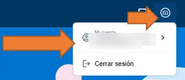
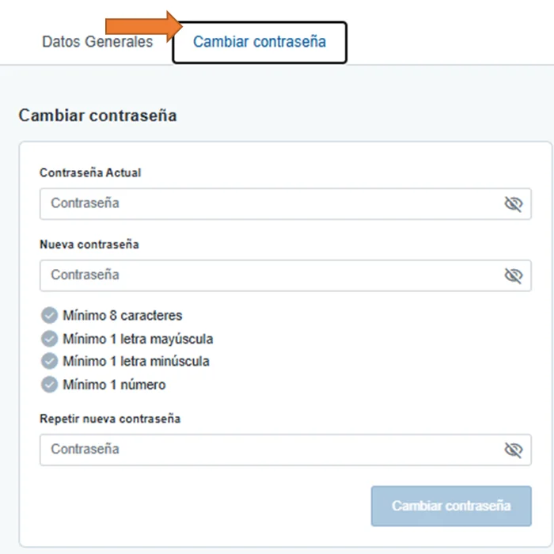

# Cambiar tu contraseña

Puedes cambiar tu contraseña cuando quieras desde **Mi cuenta**. Si no la recuerdas, [recupera tu contraseña](recuperar-tu-contrasena.md).

## Cambia la contraseña 



### Abre Mi cuenta

Pulsa el icono **Tu**, arriba a la derecha del menú, y pulsa el nombre de tu cuenta.

<figure></figure>



### Escribe la contraseña actual y la nueva

Pulsa **Cambiar contraseña**. Escribe tu contraseña actual y la nueva, y repite la nueva. Debe tener al menos 8 caracteres, una letra mayúscula, una letra minúscula y un número. Pulsa **Cambiar contraseña**.

<figure></figure>



## Más sobre alta y acceso 

**Preguntas frecuentes**


