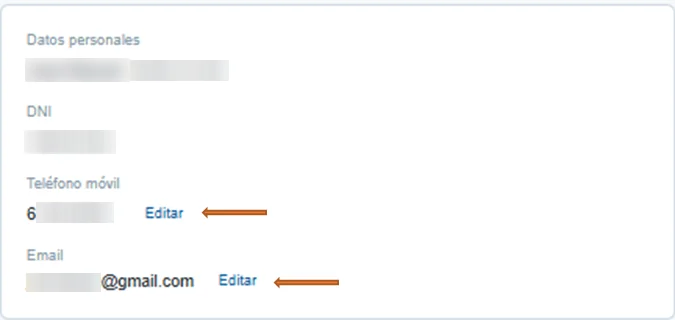
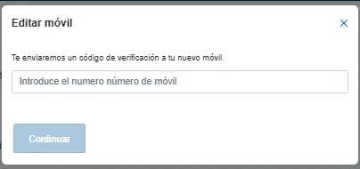

# Cambiar tus datos de contacto

Puedes cambiar tu teléfono móvil y tu correo electrónico desde **Mi cuenta**. Son los datos a los que te enviamos [el código de verificación](doble-factor-de-seguridad.md) al entrar.

## Cambia el teléfono o el correo 



### Abre Mi cuenta

Pulsa el icono **Tu**, arriba a la derecha del menú, y pulsa el nombre de tu cuenta.

<figure></figure>



### Pulsa Editar

En **Datos personales**, pulsa **Editar** junto al teléfono móvil o al correo electrónico.

<figure></figure>



### Escribe el dato nuevo y confírmalo

Escribe el nuevo teléfono o el nuevo correo y pulsa **Continuar**. Recibirás un código de verificación en ese teléfono o en ese correo para confirmarlo.

<figure></figure>



## Más sobre alta y acceso 

**Preguntas frecuentes**


