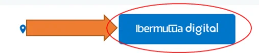
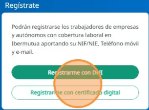
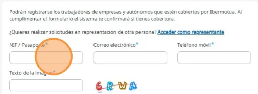
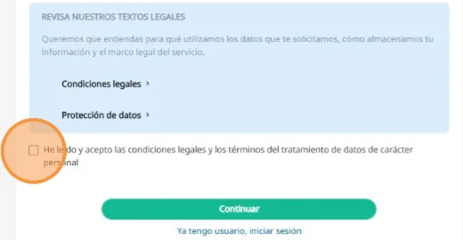
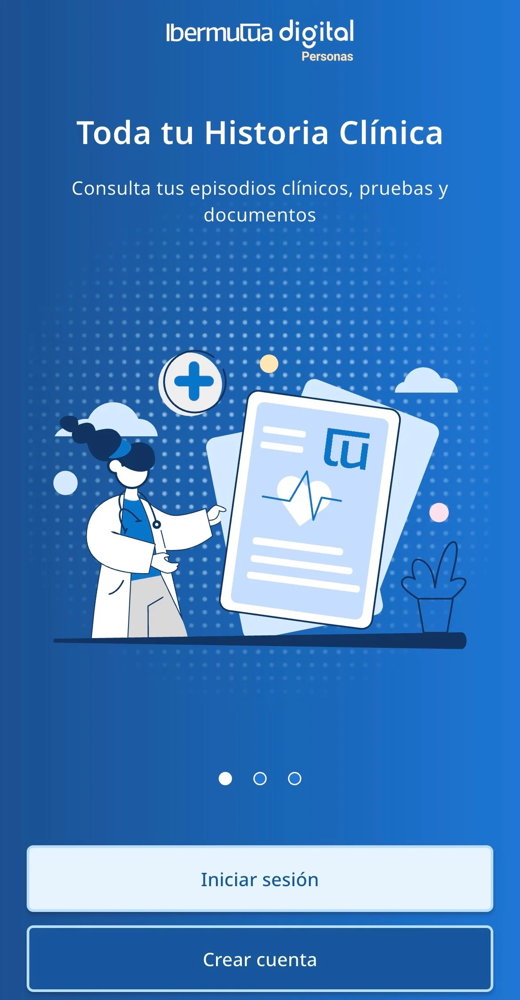
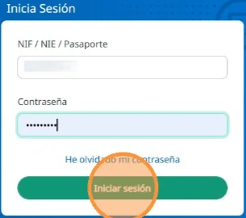

# Darte de alta en Ibermutua Digital Personas

Para usar Ibermutua Digital Personas, regístrate una vez como paciente digital, en la web o en la app. Pueden registrarse las personas trabajadoras de empresas y las autónomas con cobertura laboral en Ibermutua, con su NIF o NIE, su teléfono móvil y su correo electrónico. Puedes hacerlo con tu DNI o con un [certificado digital válido](../preguntas-frecuentes/certificados-validos.md).

Si no puedes darte de alta con el DNI y no tienes certificado digital, consulta [qué hacer](../preguntas-frecuentes/no-puedo-darme-de-alta.md).

## Regístrate 





### Abre Ibermutua Digital Personas

Entra en [Ibermutua Digital Personas](https://personas.ibermutua.es/). También puedes llegar desde la [web de Ibermutua](https://www.ibermutua.es/), pulsando **Ibermutua digital**, arriba a la derecha.

<figure></figure>



### Elige cómo registrarte

En **Regístrate**, pulsa **Registrarme con DNI** o **Registrarme con certificado digital**.

<figure></figure>



### Rellena tus datos

Completa los campos obligatorios: NIF o pasaporte, correo electrónico, teléfono móvil y el texto de la imagen de seguridad. Al rellenar el formulario, el sistema te confirma si tienes cobertura.

<figure></figure>



### Acepta las condiciones y continúa

Marca **He leído y acepto las condiciones legales y los términos del tratamiento de datos de carácter personal** y pulsa **Continuar**. Recibirás una contraseña temporal para el primer acceso, que tendrás que cambiar después.

<figure></figure>







### Descarga la app

Descarga Ibermutua Digital Personas en [App Store](https://apps.apple.com/es/app/ibermutua/id1452838556) (iOS) o en [Google Play](https://play.google.com/store/apps/details?id=es.ibermutua.app) (Android).



### Crea tu cuenta

Abre la app, pulsa **Crear cuenta** y sigue los pasos del registro.

<figure></figure>





## Entra en Ibermutua Digital Personas 



En **Inicia sesión**, escribe tu NIF, NIE o número de pasaporte y tu contraseña, y pulsa **Iniciar sesión**.

<figure></figure>



Pulsa **Iniciar sesión** y escribe tus datos. En la app también puedes [entrar con biometría](acceder-con-biometria.md).



Por seguridad, a veces te pediremos además un código de verificación: consulta [cómo funciona el doble factor](doble-factor-de-seguridad.md).

## Más sobre alta y acceso 

**Preguntas frecuentes**



**También te puede interesar**


[Acceder con biometría](acceder-con-biometria.md)



[Cambiar tus datos de contacto](cambiar-tus-datos-de-contacto.md)

