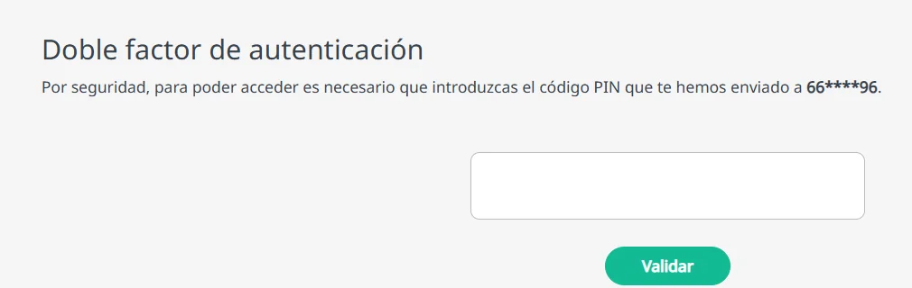

# Verificar tu identidad con el doble factor

Para proteger el acceso, Ibermutua usa un doble factor de autenticación: además de tu contraseña, a veces te pide un código de verificación. Así se reduce el riesgo de accesos no autorizados.

## Cuándo te pedimos el código 

Si ya te has verificado con el doble factor en los últimos 30 días desde el mismo dispositivo, entras sin código.

Si no, te enviamos un código de seis cifras, normalmente por correo electrónico. En algunos casos, por ejemplo si no tienes un correo registrado en Ibermutua o es de un dominio con problemas de entrega como hotmail, el código llega por SMS. Por seguridad, el correo y el teléfono se muestran enmascarados.

El código llega al correo o al teléfono que tienes registrados. Si han cambiado, [actualiza tus datos de contacto](cambiar-tus-datos-de-contacto.md).

## Introduce el código 

Escribe el código que te hemos enviado y pulsa **Validar**.

<figure></figure>

Tienes tres intentos, y el código caduca en pocos minutos. Si te equivocas o caduca, puedes pedir uno nuevo. Para evitar ataques automatizados, hay un límite de envíos en un periodo de tiempo.
