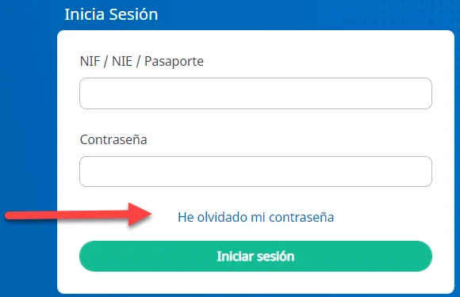
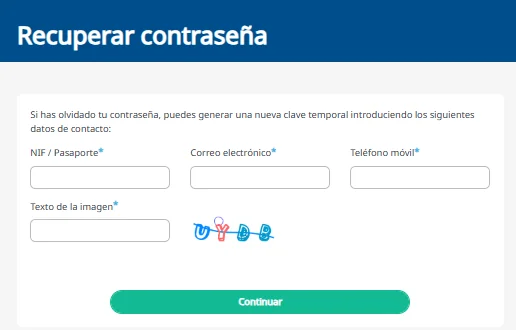

# Recuperar tu contraseña

Si has olvidado tu contraseña, puedes generar una nueva desde la página de inicio de sesión. Para comprobar tu identidad, te pediremos los datos que diste al darte de alta. Si la recuerdas y solo quieres cambiarla, [cambia tu contraseña](cambiar-tu-contrasena.md).

## Genera una contraseña nueva 



### Pulsa He olvidado mi contraseña

En la página de inicio de sesión de [Ibermutua Digital Personas](https://personas.ibermutua.es/), pulsa **He olvidado mi contraseña**.

<figure></figure>



### Escribe tus datos

Escribe tu NIF o pasaporte, tu correo electrónico y tu teléfono móvil, los mismos que diste al darte de alta, y el texto de la imagen. Pulsa **Continuar**.

<figure></figure>



### Personaliza la contraseña temporal

A partir de aquí, el proceso es el mismo que en el alta: recibirás una contraseña temporal para el primer acceso, que tendrás que cambiar después.



## Más sobre alta y acceso 

**Preguntas frecuentes**


