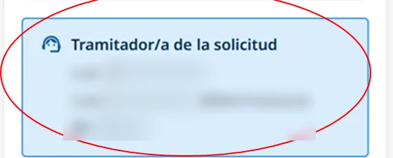

# Canales de atención

Para que te respondamos bien desde el primer contacto, elige el canal según el tipo de consulta.

## Qué canal usar 

| Consulta | Canal | Por ejemplo |
| --- | --- | --- |
| Médica | [Chat con el servicio médico](#canales-chat) | Dudas sobre síntomas, tratamiento o seguimiento médico |
| Prestaciones económicas | [Tu tramitador/a](#canales-tramitador) | Solicitudes, documentación, estado del trámite o autoliquidación |
| Citas y gestiones | [Línea de Atención Telefónica Integral 24 h](#canales-telefono) | Pedir o cambiar una cita, cambios de datos y otros trámites administrativos |

## Chat con el servicio médico 



Consulta [cómo usar el chat](servicios-medicos-digitales/chat-con-el-servicio-medico.md).

## Tu tramitador/a 

Para consultas sobre tus prestaciones económicas: solicitudes, documentación, estado del trámite o autoliquidación. Puedes escribirle por correo electrónico o llamarle por teléfono.



<figure></figure>

## Línea de Atención Telefónica Integral 24 h 

Para citas y gestiones administrativas, como pedir o cambiar una cita, cambios de datos u otros trámites, llama al <code class="expression">space.vars.telefono_atencion</code>.
