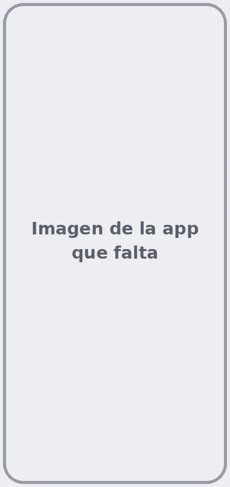

# Consultar tus citas — prueba Markdown

Tus próximas citas aparecen en la página de inicio de Ibermutua Digital Personas, en **Tus próximas citas**, tanto en la web como en la app. Solo se muestran las citas pendientes: las pasadas quedan en tu historia clínica, dentro de cada episodio médico. Consulta [cómo ver tu historia clínica](../tu-historia-clinica/consultar-tu-historia-clinica.md).

## Abre tu cita 





### Entra en Ibermutua Digital Personas

Accede a [Ibermutua Digital Personas](https://personas.ibermutua.es/).



### Pulsa la cita

En la página de inicio, en **Tus próximas citas**, pulsa la cita que quieres consultar. A la derecha se abre el panel con su información.

<figure></figure>







### Abre la app

Abre la app en tu móvil.



### Busca la cita en Tus próximas citas

En la pantalla de inicio, en **Tus próximas citas**, verás cada cita con su fecha, su hora y si es presencial. Si tienes varias, desliza para ver las siguientes.

<figure></figure>





## Información de la cita 

En el panel de la cita encontrarás estos apartados:

* **Detalles de la cita:** día, hora, facultativo, tipo de cita y centro, con un mapa.
* **Sobre esta sesión:** el tipo de sesión (por ejemplo, presencial) y en qué consiste.
* **Lo que vas a necesitar:** el documento de identidad que debes llevar (DNI, NIE o pasaporte) y las indicaciones para cuando llegues al centro.



<figure></figure>



<figure></figure>



## Qué puedes hacer desde tu cita 

Con la cita abierta, puedes:

* [Ver cómo llegar al centro](#citas-como-llegar)
* [Aportar documentación](#citas-documentacion)
* [Añadir la cita a tu calendario](#citas-calendario)

### Ver cómo llegar al centro 

Debajo del mapa del panel, pulsa **Abrir en Google Maps** para ver la ruta hasta el centro.

### Aportar documentación 

Si tu médico/a tiene que revisar alguna prueba antes o durante la cita:

1. En el panel de la cita, pulsa **Ir a mi episodio médico**.
2. [Sube los documentos](https://soporte-ibermutua-digital.scroll.site/soporte-ibermutua-digital/intercambio-online-de-documentacion-con-la-mutua) en la sección **Documentos** del episodio. Así estarán disponibles en la consulta.



<figure></figure>



<figure></figure>



### Añadir la cita a tu calendario 

1. En el panel de la cita, pulsa **Añadir al calendario**.
2. Elige Google Calendar, Office 365 o ICS (Outlook o Apple Calendar).



<figure></figure>



<figure></figure>



## Si necesitas cambiar la cita 



## También te puede interesar 


[Descargar un justificante de asistencia](descargar-un-justificante.md)


## ¿Necesitas contactar? 


