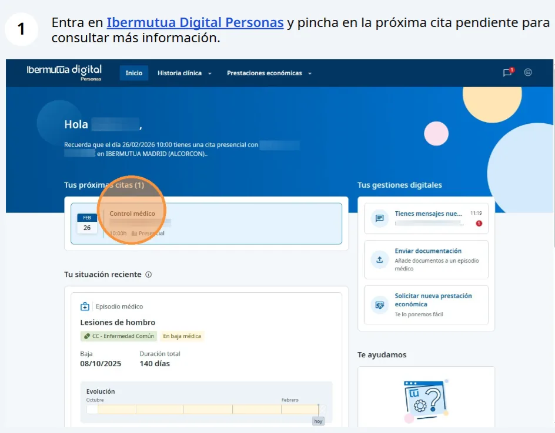
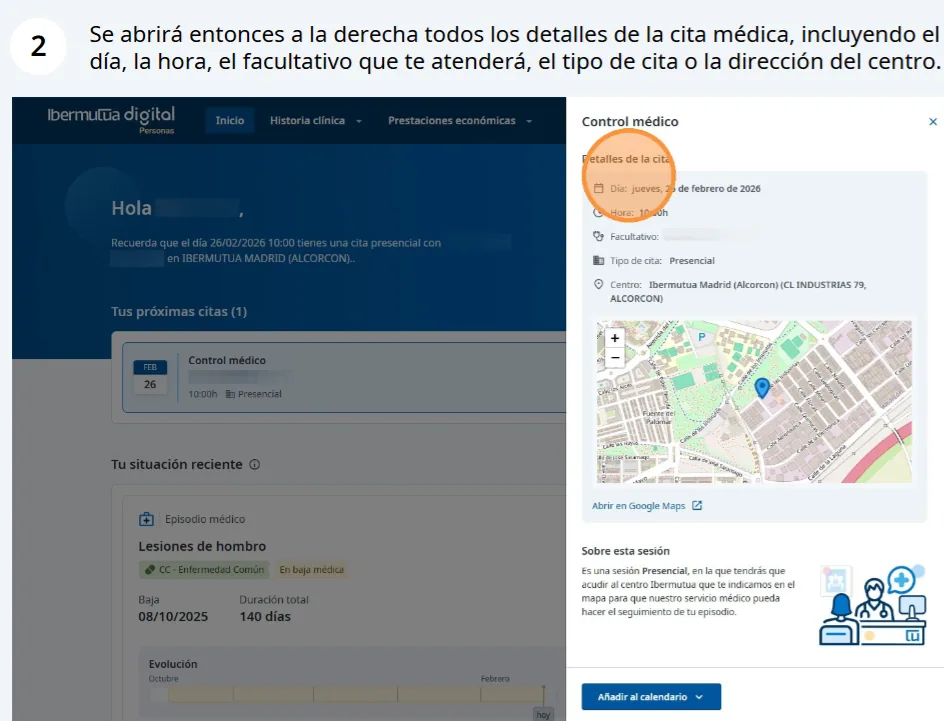
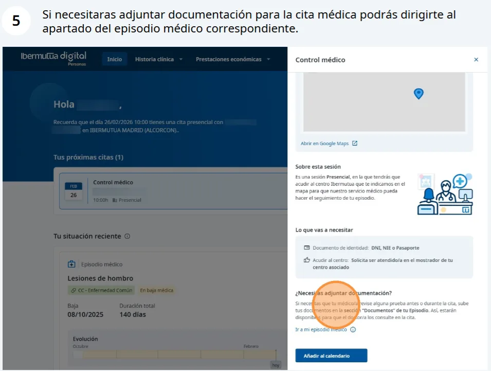
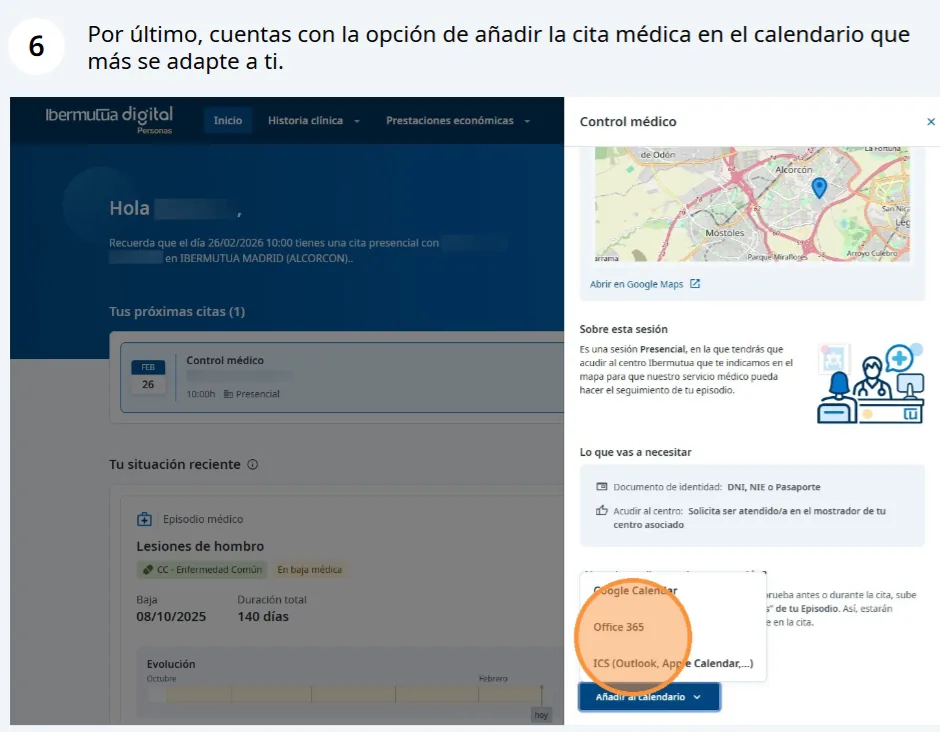

# Consultar tus citas — prueba Markdown

Tus próximas citas aparecen en la página de inicio de Ibermutua Digital Personas, en **Tus próximas citas**, tanto en la web como en la app.


**No puedes cambiar una cita desde Ibermutua Digital Personas.** Consulta [cómo solicitar el cambio](#citas-cambiar).


Elige la versión que utilizas:



## Abre y consulta tu cita 

Entra en [Ibermutua Digital Personas](https://personas.ibermutua.es/) y, en **Tus próximas citas**, pulsa la cita que quieres consultar. A la derecha se abre el panel con su información.

<figure></figure>

### Información de la cita 

En el panel encontrarás estos apartados:

* **Detalles de la cita:** día, hora, facultativo, tipo de cita y centro.
* **Sobre esta sesión:** información sobre la sesión.
* **Lo que vas a necesitar:** documento de identidad e indicaciones para acudir al centro.

<figure></figure>

### Qué llevar 

En **Lo que vas a necesitar** tienes el documento de identidad que debes llevar (DNI, NIE o pasaporte) y las indicaciones para cuando llegues al centro.

## Qué puedes hacer desde tu cita 

Con la cita abierta, puedes realizar estas acciones. Abre la opción que te interese:

Ver cómo llegar al centro

Debajo del mapa del panel, pulsa **Abrir en Google Maps** para ver la ruta hasta el centro.

Aportar documentación

Si tu médico/a tiene que revisar alguna prueba antes o durante la cita, pulsa **Ir a mi episodio médico** y [sube los documentos](https://soporte-ibermutua-digital.scroll.site/soporte-ibermutua-digital/intercambio-online-de-documentacion-con-la-mutua) en la sección **Documentos** del episodio.

Añadir la cita a tu calendario

Pulsa **Añadir al calendario** y elige Google Calendar, Office 365 o ICS (Outlook o Apple Calendar).




## Consulta tu próxima cita 

Abre la app. En la pantalla de inicio, en **Tus próximas citas**, verás cada cita con su fecha, su hora y si es presencial. Si tienes varias, desliza para ver las siguientes.

<figure></figure>



## Preguntas frecuentes sobre citas 

### ¿Buscas una cita anterior? 

**Tus próximas citas** solo muestra las citas pendientes. Las citas pasadas quedan en tu historia clínica, dentro de cada episodio médico. Consulta [cómo ver tu historia clínica](../tu-historia-clinica/consultar-tu-historia-clinica.md).

### ¿Puedo cambiar una cita? 

No. Por ahora no puedes cambiar una cita desde Ibermutua Digital Personas. Para cambiarla, ponte en contacto con el servicio médico de la mutua por teléfono o, si [tienes el alta como paciente digital](https://soporte-ibermutua-digital.scroll.site/soporte-ibermutua-digital/tu-alta-y-acceso-a-ibermutua-digital-personas), [por chat](https://soporte-ibermutua-digital.scroll.site/soporte-ibermutua-digital/chat-con-el-servicio-medico-de-ibermutua).

## También te puede interesar 


[Descargar un justificante de asistencia](descargar-un-justificante.md)

