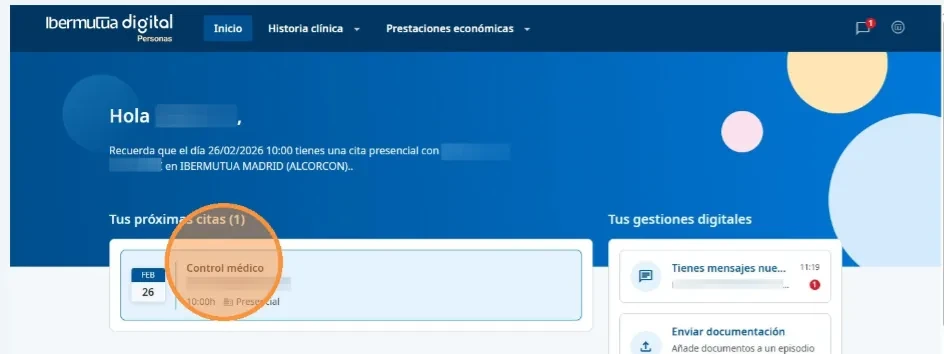
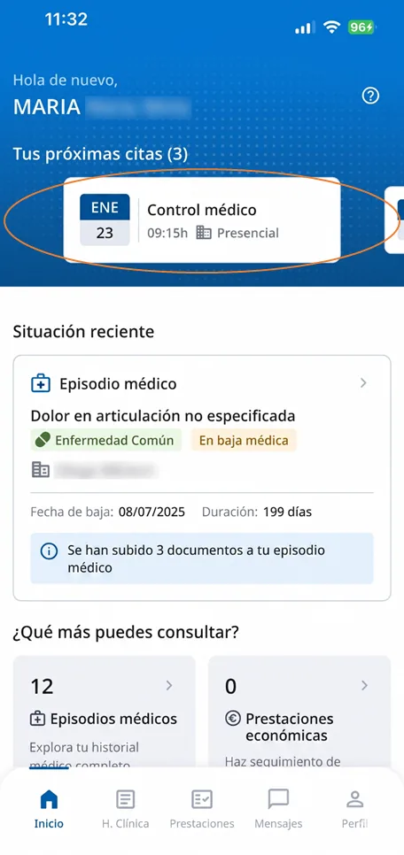
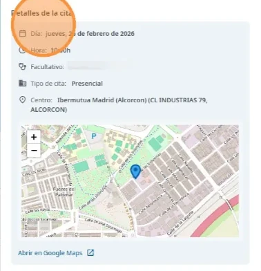
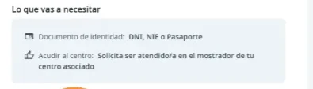
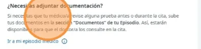
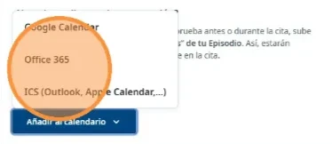

# Consultar tus citas

Tus citas pendientes aparecen en la página de inicio de Ibermutua Digital Personas, en **Tus próximas citas**, tanto en la web como en la app. Las citas pasadas quedan en tu historia clínica, dentro de cada episodio médico: consulta [cómo ver tu historia clínica](../tu-historia-clinica/consultar-tu-historia-clinica.md).


**No puedes cambiar una cita desde Ibermutua Digital Personas.** Consulta [cómo solicitar el cambio](../preguntas-frecuentes/cambiar-una-cita.md).


## Abre tu cita 





### Entra en Ibermutua Digital Personas

Accede a [Ibermutua Digital Personas](https://personas.ibermutua.es/). En la página de inicio verás **Tus próximas citas**.



### Pulsa la cita

Pulsa la cita que quieres consultar. A la derecha se abre el panel con su detalle.

<figure></figure>







### Abre la app

En la pantalla de inicio, en **Tus próximas citas**, verás cada cita con su fecha, su hora y si es presencial. Si tienes varias, desliza para ver las siguientes.

<figure></figure>



### Pulsa la cita

Pulsa la cita que quieres consultar para ver su detalle.





## Información de la cita 

En el detalle de la cita encontrarás estos apartados.

**Detalles de la cita**

Día, hora, facultativo, tipo de cita y centro, con un mapa.



<figure></figure>



<figure></figure>



**Sobre esta sesión**

El tipo de sesión (por ejemplo, presencial) y en qué consiste.

**Lo que vas a necesitar**

El documento de identidad que debes llevar (DNI, NIE o pasaporte) y las indicaciones para cuando llegues al centro.



<figure></figure>



<figure></figure>



## Qué puedes hacer desde tu cita 

Con la cita abierta, puedes:

**A. Ver cómo llegar al centro**

Pulsa **Abrir en Google Maps**, debajo del mapa de **Detalles de la cita**.

**B. Aportar documentación**

Si tu médico/a tiene que revisar alguna prueba antes o durante la cita:

1. Pulsa **Ir a mi episodio médico**.
2. [Sube los documentos](../tu-historia-clinica/enviar-documentacion.md) en la sección **Documentos** del episodio. Así estarán disponibles en la consulta.



<figure></figure>



<figure></figure>



**C. Añadir la cita a tu calendario**

1. Pulsa **Añadir al calendario**.
2. Elige Google Calendar, Office 365 o ICS (Outlook o Apple Calendar).



<figure></figure>



<figure></figure>



## Más sobre citas 

**Preguntas frecuentes**



**También te puede interesar**


[Descargar un justificante de asistencia](descargar-un-justificante.md)



[Hacer una videoconsulta](../servicios-medicos-digitales/videoconsulta.md)

