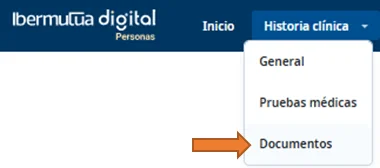
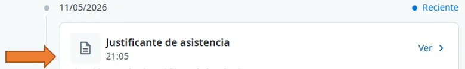
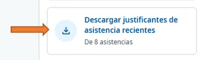

# Descargar un justificante de asistencia

El justificante de asistencia acredita que acudiste a una cita, una prueba o una gestión sanitaria, y suele usarse para justificar la ausencia ante tu empresa. Puedes descargarlo en PDF desde **Historia clínica > Documentos** o desde el episodio médico, y también descargar a la vez todos los justificantes recientes.

## Descarga el justificante 



### Entra en Documentos

Entra en [Ibermutua Digital Personas](https://personas.ibermutua.es/) con tu DNI y tu contraseña. En el menú superior, pulsa **Historia clínica** y elige **Documentos**.

<figure></figure>



### Busca el justificante

Localiza el justificante de asistencia en el listado. Para encontrarlo antes, filtra por tipo de documento o por fecha.

<figure></figure>



### Abre su ficha y descárgalo

Pulsa el justificante para abrir su ficha. Al final de la ficha, pulsa **Descargar documento**. Antes de enviarlo a tu empresa, comprueba que la fecha, la hora y el centro son correctos.



## Otras formas de descargarlo 

**A. Desde el episodio médico**

[Abre el episodio médico](../tu-historia-clinica/consultar-tu-historia-clinica.md#historia-abrir) desde **Tu situación reciente** o desde **Historia clínica**. Junto al **Justificante de asistencia**, pulsa **Ver** y descarga el PDF.

**B. Todos los justificantes recientes a la vez**

En el episodio, en **Tus gestiones digitales**, pulsa **Descargar justificantes de asistencia recientes**. Se descargan los últimos justificantes en un archivo ZIP.

<figure></figure>

## Dudas e incidencias 

No encuentro el justificante

* Amplía el rango de fechas o revisa el filtro por tipo de documento.
* Comprueba si está clasificado como informe de consulta o como prueba asociada a la cita.
* Actualiza la página o vuelve a iniciar sesión.

No aparece el botón Descargar documento

Asegúrate de haber abierto la ficha del documento, no solo el listado.

El PDF no se abre o se descarga dañado

* Prueba con otro navegador o borra la caché del que usas.
* Vuelve a descargarlo con una conexión estable.
* Comprueba que tu visor de PDF está actualizado.

Necesito el justificante de un día concreto

Abre la ficha de la cita de ese día y descarga el documento asociado a esa atención.

¿Puedo descargar justificantes de fechas pasadas?

Sí, siempre que el episodio o la asistencia consten en tu historial. Usa el filtro de fechas para localizarlo. Si no aparece, [contacta con Ibermutua](../canales-de-atencion.md) o con tu centro asistencial para comprobar que se ha emitido.

¿En qué formato se descarga y le sirve a mi empresa?

En PDF firmado digitalmente. En la mayoría de los casos, el PDF que emite Ibermutua es válido como acreditación de la asistencia; consulta si tu empresa pide un canal de envío concreto. Conserva el archivo original y no lo edites: cualquier cambio puede invalidar el justificante.

Consejos para guardarlo y enviarlo

* Al guardarlo, ponle un nombre fácil de encontrar, por ejemplo `Justificante_asistencia_Apellido_Nombre.pdf`.
* Si necesitas varios justificantes (por ejemplo, de varias pruebas el mismo día), descarga cada uno desde su ficha.
* Contiene datos de salud: compártelo solo con quien deba recibirlo y por canales seguros.

## Más sobre justificantes 

**También te puede interesar**


[Consultar tus citas](consultar-tus-citas.md)



[Consultar la documentación administrativa](../tu-historia-clinica/consultar-documentacion-administrativa.md)

