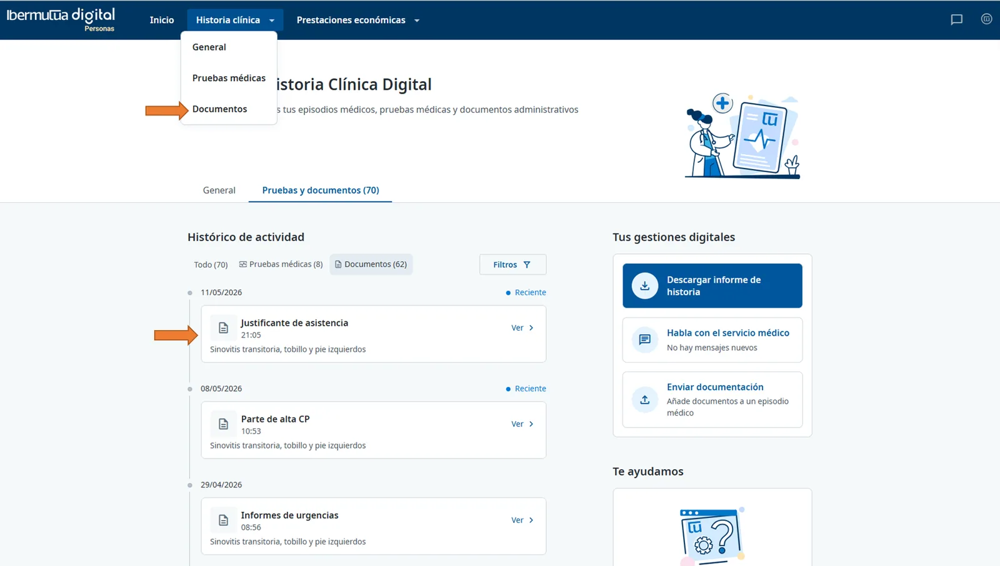
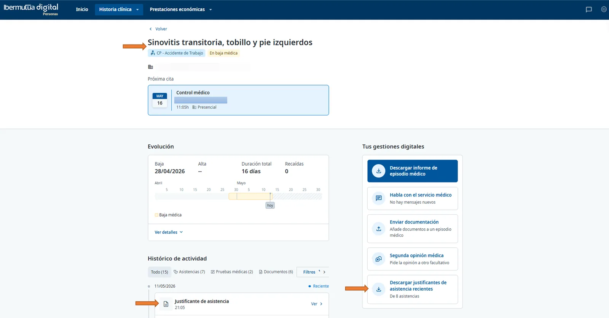

# Descargar un justificante de asistencia

Puedes descargar en PDF cualquier justificante de asistencia desde **Historia clínica > Documentos** o desde el episodio médico. También puedes descargar todos los justificantes recientes a la vez.


El justificante de asistencia es un documento de Ibermutua que acredita que acudiste a una cita, prueba o gestión sanitaria. Suele usarse para justificar la ausencia ante tu empresa.


## Desde Documentos 



### Entra en Documentos 

Entra en [Ibermutua Digital Personas](https://personas.ibermutua.es/) con tu DNI y tu contraseña. En el menú superior, pulsa **Historia clínica** y elige **Documentos**.



### Busca el justificante 

Localiza el justificante de asistencia en el listado. Para encontrarlo antes, filtra por tipo de documento o por fecha.

<figure> Documentos con un Justificante de asistencia señalado en el histórico de actividad."><figcaption>
Justificante de asistencia en Documentos.
</figcaption></figure>



### Abre su ficha y descárgalo 

Pulsa el justificante para abrir su ficha. Al final de la ficha, pulsa **Descargar documento**.



## Desde el episodio médico 

[Abre el episodio médico](../tu-historia-clinica/consultar-tu-historia-clinica.md#historia-episodio), desde **Tu situación reciente** o desde **Historia clínica**. Junto al **Justificante de asistencia**, pulsa **Ver** y descarga el PDF.

## Todos los justificantes recientes 

En el episodio, en **Tus gestiones digitales**, a la derecha, pulsa **Descargar justificantes de asistencia recientes**. Se descargan los últimos justificantes en un archivo ZIP.

<figure><figcaption>
Justificantes desde el episodio y descarga de los recientes.
</figcaption></figure>


**Al terminar** tendrás el justificante en PDF en tu dispositivo. Antes de enviarlo a tu empresa, comprueba que la fecha, la hora y el centro son correctos.


## Consejos 

* Al guardarlo, ponle un nombre fácil de encontrar, por ejemplo `Justificante_asistencia_Apellido_Nombre.pdf`.
* Si necesitas varios justificantes (por ejemplo, de varias pruebas el mismo día), descarga cada uno desde su ficha.
* Guarda una copia en un lugar seguro.
* No edites el PDF: cualquier cambio puede invalidar el justificante. Compártelo solo con quien deba recibirlo y por canales seguros.

## Si algo no sale como esperas 

No encuentro el justificante

* Amplía el rango de fechas o revisa el filtro por tipo de documento.
* Comprueba si está clasificado como informe de consulta o como prueba asociada a la cita.
* Actualiza la página o vuelve a iniciar sesión.

No aparece el botón Descargar documento

Asegúrate de haber abierto la ficha del documento, no solo el listado.

El PDF no se abre o se descarga dañado

* Prueba con otro navegador o borra la caché del que usas.
* Vuelve a descargarlo con una conexión estable.
* Comprueba que tu visor de PDF está actualizado.

Necesito el justificante de un día concreto

Abre la ficha de la cita de ese día y descarga el documento asociado a esa atención.

## Dudas frecuentes 

¿Puedo descargar justificantes de fechas pasadas?

Sí, siempre que el episodio o la asistencia consten en tu historial. Usa el filtro de fechas para localizarlo. Si no aparece, contacta con Ibermutua o con tu centro asistencial para comprobar que se ha emitido.

¿En qué formato se descarga?

En PDF firmado digitalmente. Conserva el archivo original para mantener su validez.

¿Le sirve el PDF a mi empresa?

En la mayoría de los casos, sí: el PDF que emite Ibermutua es válido como acreditación de la asistencia. Consulta si tu empresa pide un canal de envío concreto.

¿Puedo descargarlo desde el móvil?

Sí, desde un navegador móvil compatible o desde la app.

## Siguientes pasos 


[consultar-tus-citas.md](consultar-tus-citas.md)


## ¿Necesitas contactar? 


