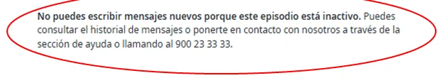

# ¿Cuándo se cierra un chat?

Cuando termina el episodio médico al que está ligado o si se hace un uso indebido de él. A partir de ese momento no puedes escribir mensajes nuevos.

## Si tu chat está cerrado 

Puedes seguir consultando el historial de mensajes. Para contactar con nosotros, consulta los [canales de atención](../canales-de-atencion.md) o llama al <code class="expression">space.vars.telefono_atencion</code>.

<figure></figure>

Consulta [cómo usar el chat](../servicios-medicos-digitales/chat-con-el-servicio-medico.md).
