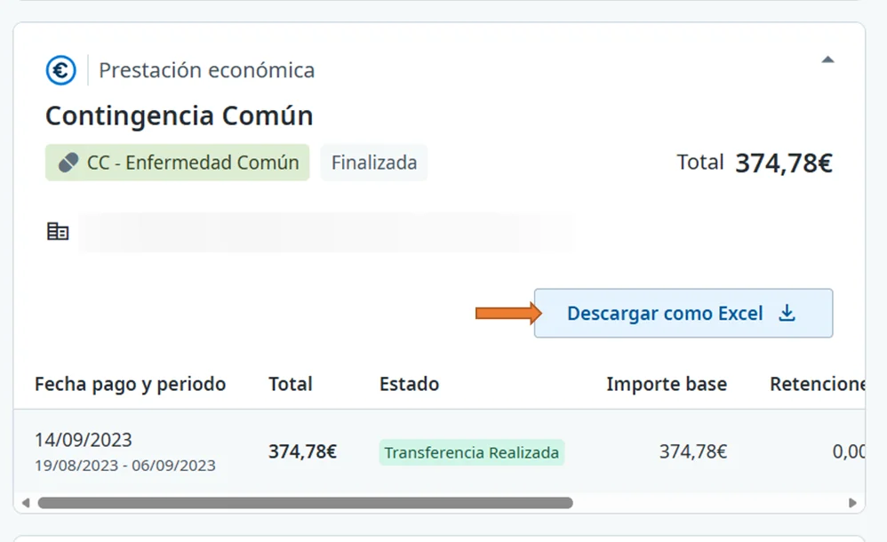

# Consultar tus pagos

En **Pagos** ves el estado de abono de todas tus prestaciones económicas, también las de pago directo, y puedes descargar el detalle de cada una.

## Consulta tus pagos 



### Abre Pagos

En el menú superior, pulsa **Prestaciones económicas** > **Pagos**.

<figure></figure>



### Abre una prestación

Pulsa una prestación para ver el detalle de sus pagos: fecha y periodo, total, estado, importe base y retenciones.



### Descarga el detalle, si lo necesitas

Pulsa **Descargar como Excel**.

<figure></figure>



## Estados del pago 

En la columna **Estado** verás:

* **Autorizado pendiente de pago**: el pago está aprobado y preparado para salir.
* **Transferencia realizada**: el dinero ya se ha enviado a tu banco.

## Más sobre pagos y retenciones 

**Preguntas frecuentes**



**También te puede interesar**


[Descargar el certificado de retenciones (IRPF)](descargar-el-certificado-de-retenciones.md)



[Solicitar la autoliquidación](solicitar-la-autoliquidacion.md)

