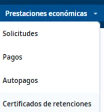
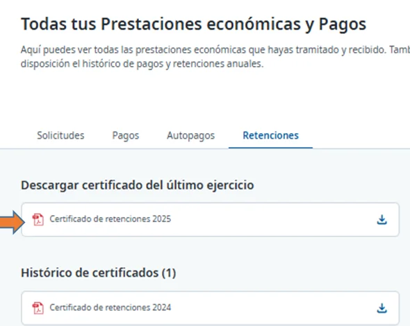

# Descargar el certificado de retenciones (IRPF)

El certificado de retenciones recoge las cantidades que te ha pagado Ibermutua en un ejercicio y las retenciones del IRPF que se te han aplicado. Es un PDF firmado electrónicamente. Cada año se publica el del ejercicio anterior, cuando se cierran sus datos.

## Descarga el certificado 



### Abre Certificados de retenciones

En el menú superior, pulsa **Prestaciones económicas** > **Certificados de retenciones**. Se abre la pestaña **Retenciones**.

<figure></figure>



### Descarga el certificado

En **Descargar certificado del último ejercicio**, pulsa el icono de descarga. Los de años anteriores están en **Histórico de certificados**.

<figure></figure>



También puedes descargarlo desde el navegador del móvil.

## Más sobre pagos y retenciones 

**También te puede interesar**


[Consultar tus pagos](consultar-tus-pagos.md)

