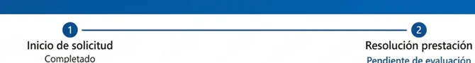
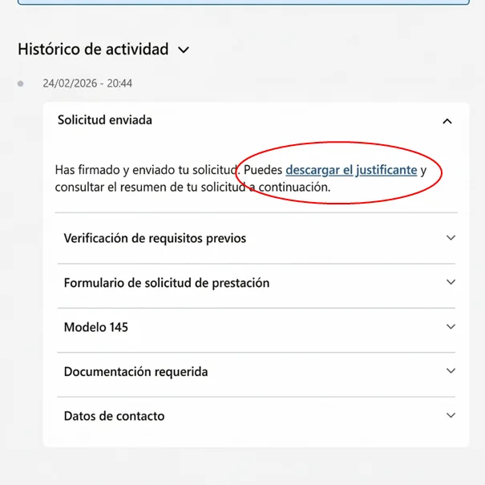
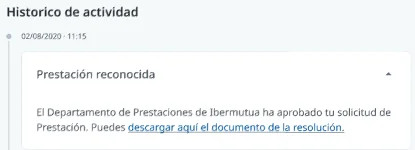

# Consultar el estado de tu solicitud

En la página de tu solicitud ves en qué fase está y, en **Histórico de actividad**, todo lo que ha pasado desde que la enviaste. Desde ahí descargas el justificante y, cuando la mutua la resuelve, la resolución.

Para abrirla, en el menú superior pulsa **Prestaciones económicas** > **Solicitudes** y elige la solicitud en **Histórico de solicitudes**.

## Sigue las fases de tu solicitud 

Arriba verás las dos fases, **Inicio de solicitud** y **Resolución prestación**, con su estado. Cuando la envías, la solicitud queda **Pendiente de evaluación**.

<figure></figure>

## Descarga el justificante 

En **Histórico de actividad**, abre **Solicitud enviada** y pulsa **descargar el justificante**. Incluye toda la información y la documentación que aportaste. También lo recibes por correo electrónico.

<figure></figure>

## Consulta la resolución 

Cuando la mutua revisa la solicitud, la aprueba o la deniega y te envía el resultado por correo electrónico. Si la aprueba, en **Histórico de actividad** aparece **Prestación reconocida**: pulsa **descargar aquí el documento de la resolución** para obtener la carta de reconocimiento.

<figure></figure>

Si la mutua te pide más documentación, consulta [cómo subsanarla](subsanar-documentacion.md). Si no estás de acuerdo con la resolución, puedes [reclamarla](../reclamar-una-resolucion.md).

## Contacta con tu tramitador/a 

Si tienes dudas sobre tu solicitud, contacta con tu tramitador/a. En la página de la solicitud, sus datos están en **Tramitador/a de la solicitud**.



<figure></figure>

## Más sobre el pago directo 

**Preguntas frecuentes**



**También te puede interesar**


[Consultar tus pagos](../consultar-tus-pagos.md)

