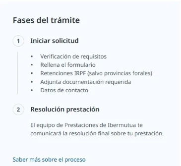
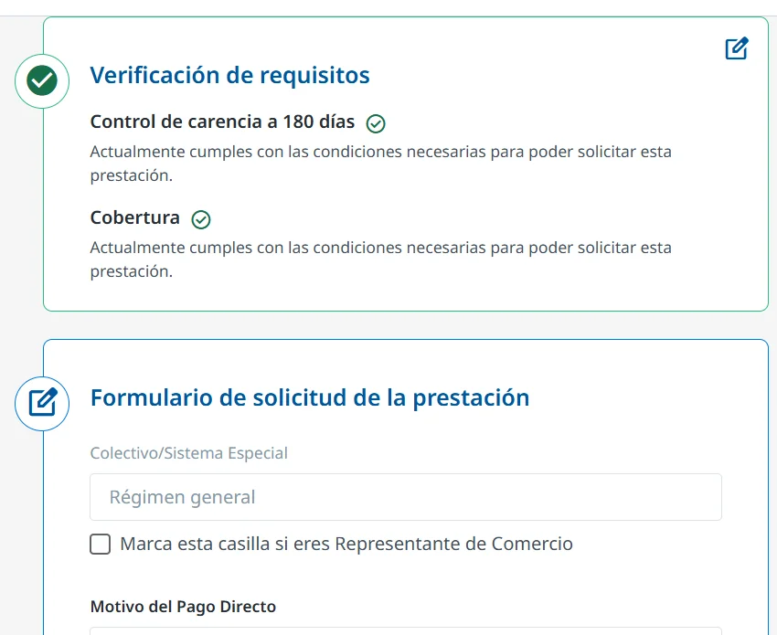

# Rellenar la solicitud de pago directo

El formulario te pide la información según tu situación y la de tu proceso. No puedes pasar a un paso sin completar los datos obligatorios del anterior. Puedes guardar un borrador en cualquier momento y seguir más tarde donde lo dejaste.

Los pasos son los mismos si la solicitud la hace un [representante](solicitar-como-representante.md).

## Completa el formulario 

A la izquierda de la solicitud verás las fases del trámite y los pasos que te faltan.

<figure></figure>



### Revisa la verificación de requisitos

El sistema comprueba automáticamente si cumples los requisitos para pedir la prestación. Si no estás de acuerdo con el resultado, puedes añadir alegaciones y documentos y seguir con el formulario: la mutua los revisará después.

<figure></figure>



### Rellena los datos de la solicitud

Completa los campos obligatorios: se usan para tramitar la prestación y calcular su importe.



### Rellena el modelo 145, si te lo pide

Según tu provincia, tendrás que rellenar el modelo 145 para calcular la retención del IRPF. Se abre un formulario y, al terminarlo, se genera un PDF que se añade a la solicitud.



### Rellena la declaración de actividad, si eres autónomo/a

Si trabajas por cuenta propia, también rellenas la declaración de actividad en un formulario. El PDF se genera y se añade a la solicitud.



### Adjunta la documentación

El formulario te indica qué documentos tienes que adjuntar según tu caso. Si no tienes alguno, puedes añadir una alegación y seguir: la mutua lo comprobará después. Los documentos marcados como obligatorios no admiten alegación: sin ellos no puedes continuar.

Si algún documento no es correcto, la mutua puede pedirte después que lo [subsanes](subsanar-documentacion.md).



### Indica tus datos de contacto

Añade un correo electrónico, que tendrás que verificar con un código, y un teléfono móvil. Se usan para firmar la solicitud y para notificarte la resolución.



### Firma y envía la solicitud

Cuando completas todos los pasos, se habilita la firma. Recibirás un SMS con un código en el móvil que has indicado: escríbelo para firmar y enviar la solicitud. Es una firma digital con un código de un solo uso (OTP) y tiene plena validez legal.



Después, puedes [consultar el estado de tu solicitud](consultar-el-estado.md).

## Más sobre el pago directo 

**Preguntas frecuentes**


