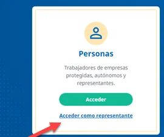
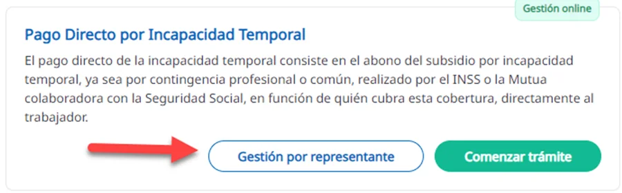
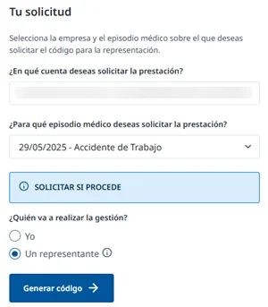
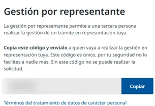
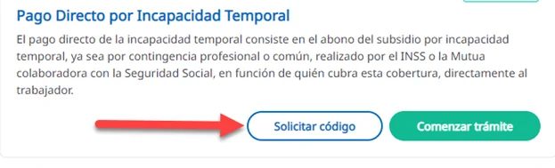
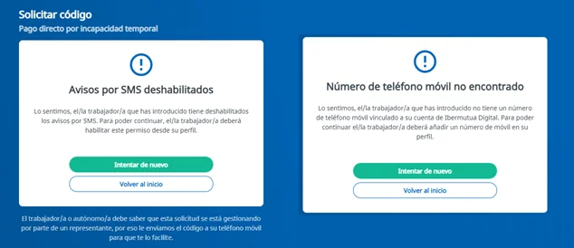

# Solicitar el pago directo como representante

Una asesoría, gestoría o profesional **no colaborador** de Ibermutua puede solicitar el pago directo en nombre de una persona trabajadora desde Ibermutua Digital Representantes. Para hacerlo necesita un código de autorización de esa persona.

Las asesorías y gestorías colaboradoras lo tramitan desde [Ibermutua Digital Asesorías](https://empresas.ibermutua.es/), sin darse de alta como representante. Tampoco necesitas ese alta si ya tienes acceso a Ibermutua Digital Asesorías.


**El código de autorización** sirve solo para la prestación indicada y no da acceso a la información sanitaria de la persona trabajadora. Caduca a los 15 días si no se usa para iniciar el trámite; después hay que generar otro. La persona trabajadora puede revocarlo mientras no se haya usado.


## Accede como representante 



### Date de alta como representante

Haz el alta en [Ibermutua Digital Representantes](https://portalsolicitudpagodirecto-representante-oficina-virtual.apps.ibermutua.es/). Solo tienes que hacerlo una vez.



### Entra en Ibermutua Digital

En [Ibermutua Digital](https://digital.ibermutua.es/), en **Personas**, pulsa **Acceder como representante**.

<figure></figure>



### Inicia sesión

Escribe el usuario y la contraseña que elegiste en el alta.



## Consigue el código de autorización 

El código puede generarlo la persona trabajadora o pedirlo el representante.

**A. Lo genera la persona trabajadora**

1. En Ibermutua Digital Personas, [abre una solicitud nueva](solicitar-el-pago-directo.md#pago-directo-empezar) y, en **Pago Directo por Incapacidad Temporal**, pulsa **Gestión por representante**.
2. Elige la cuenta y el episodio médico, marca **Un representante** y pulsa **Generar código**.
3. Pulsa **Copiar** y envía el código a tu representante por el medio que prefieras: correo electrónico, teléfono…

<figure></figure>

<figure></figure>

<figure></figure>

**B. Lo pide el representante**

1. En Ibermutua Digital Representantes, en **Pago Directo por Incapacidad Temporal**, pulsa **Solicitar código**.
2. Escribe el NIF o NIE de la persona trabajadora y la fecha de baja de su incapacidad temporal.
3. La persona trabajadora recibe el código por SMS y te lo facilita.

<figure></figure>

Si la persona trabajadora no tiene un móvil registrado en Ibermutua, lo tiene desactualizado o no ha autorizado los avisos por SMS, el código no se puede enviar y verás un aviso. En ese caso, tiene que generarlo ella (opción A).

<figure></figure>

## Tramita la solicitud 



### Comienza el trámite

En Ibermutua Digital Representantes, pulsa **Comenzar trámite** y, en la pantalla inicial de la prestación, **Sí, comenzar trámite**.



### Escribe el identificador y el código

Escribe el identificador de la persona trabajadora y el código de autorización. Comprueba antes que el código no ha caducado.



### Rellena la solicitud

Se abre el mismo formulario que usa la persona trabajadora: consulta [cómo rellenar la solicitud](rellenar-la-solicitud.md). Ten a mano su identificación, sus datos bancarios y la documentación, que debe ser legible. Puedes guardar un borrador y terminarla más tarde.



## Más sobre el pago directo 

**Preguntas frecuentes**


