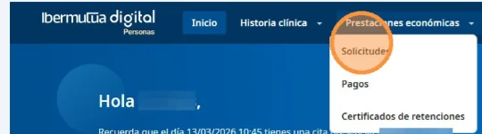
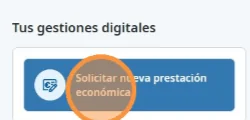
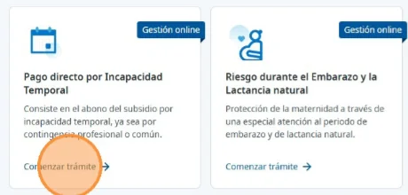
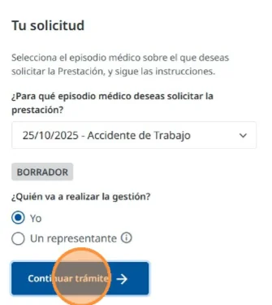

# Solicitar el pago directo por incapacidad temporal

Puedes solicitar online el [pago directo](../../preguntas-frecuentes/que-es-el-pago-directo.md) de tu prestación por incapacidad temporal. Un formulario te guía y te indica qué información necesitas en cada paso.

## Empieza la solicitud 



### Abre una solicitud nueva



<figure></figure>

<figure></figure>



### Elige el pago directo

En **Solicita tu prestación económica**, pulsa **Comenzar trámite** en **Pago directo por Incapacidad Temporal**.

<figure></figure>



### Elige el episodio y quién hace la gestión

En **Tu solicitud**, elige el episodio médico para el que pides la prestación. En **¿Quién va a realizar la gestión?**, marca **Yo** y pulsa **Continuar trámite**.

<figure></figure>

Si va a hacer la gestión otra persona en tu nombre, consulta [cómo se solicita como representante](solicitar-como-representante.md).



Se abre el formulario de la solicitud: consulta [cómo rellenarlo](rellenar-la-solicitud.md).

## Más sobre el pago directo 

**Preguntas frecuentes**



**También te puede interesar**


[Consultar el estado de tu solicitud](consultar-el-estado.md)

