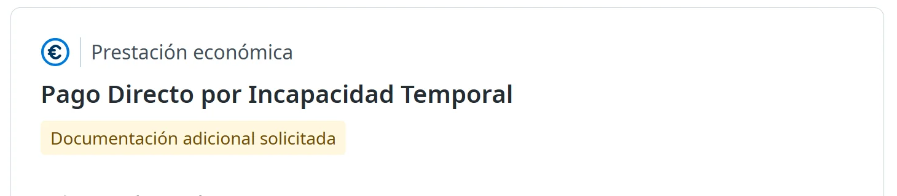
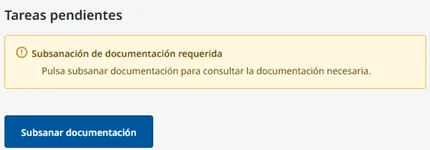
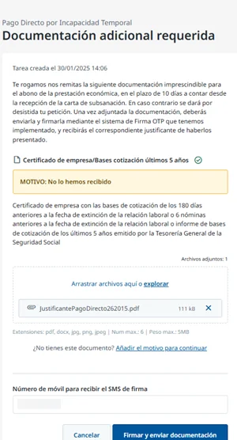

# Subsanar la documentación de tu solicitud

Si al evaluar tu solicitud de pago directo la mutua ve que falta un documento, que está incompleto o que no cumple los requisitos, te pide que lo subsanes. Puedes hacerlo todo online.

Te avisamos por correo electrónico y, al entrar en Ibermutua Digital Personas, verás tu solicitud en la página de inicio con el aviso **Documentación adicional solicitada**.

<figure></figure>

## Envía la documentación 



### Abre la tarea

En la página de tu solicitud, en **Tareas pendientes**, pulsa **Subsanar documentación**.

<figure></figure>



### Adjunta los documentos

En **Documentación adicional requerida** verás el motivo y qué documentos necesitas. Adjúntalos dentro del plazo que indica la tarea. Si no tienes alguno, pulsa **Añadir el motivo para continuar** y explica por qué.

<figure></figure>



### Firma y envía

Escribe el móvil en el que quieres recibir el SMS de firma y pulsa **Firmar y enviar documentación**. Escribe el código que recibes por SMS para firmar.

Recibirás por correo electrónico un justificante de que has respondido al requerimiento.



## Después de enviarla 

La mutua sigue evaluando tu solicitud, que continúa **pendiente de evaluación** hasta que se reconoce o se deniega. En el **Histórico de actividad** de la solicitud verás la subsanación que has hecho: consulta [cómo seguir tu solicitud](consultar-el-estado.md).

## Más sobre el pago directo 

**Preguntas frecuentes**


