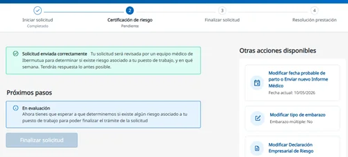
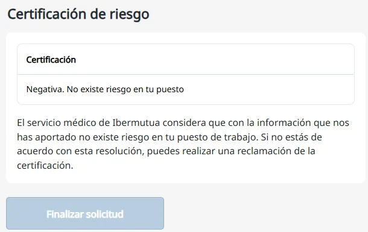
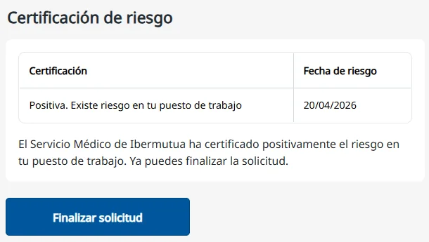
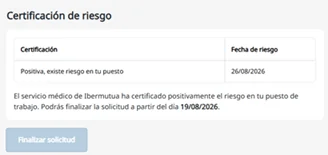
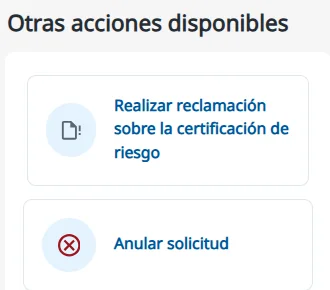

# Certificación de riesgo

Después de iniciar la solicitud, el equipo médico y de prevención de Ibermutua valora si tu puesto de trabajo supone un riesgo para tu embarazo o tu lactancia. Hasta que emite la certificación, los pasos siguientes de la solicitud están deshabilitados.

## Mientras se evalúa 

La certificación de riesgo aparece **Pendiente** y, en **Próximos pasos**, **En evaluación**. Mientras tanto, en **Otras acciones disponibles** puedes hacer gestiones como **Modificar fecha probable de parto o Enviar nuevo Informe Médico**, **Modificar tipo de embarazo** o **Modificar Declaración Empresarial de Riesgo**. Consulta [cuánto tarda la certificación](../../preguntas-frecuentes/cuanto-tarda-la-certificacion.md).

<figure></figure>

## Tipos de certificación 

Cuando la mutua emite la certificación, te avisa por correo electrónico del resultado y de si puedes finalizar la solicitud. La certificación puede ser:



Tu empresa también recibe un correo con la certificación y con la documentación que tiene que darte para finalizar la solicitud. Puede aportarla desde Ibermutua Digital Empresas.

En la página de tu solicitud verás el resultado así:

**Negativa**: el botón **Finalizar solicitud** queda deshabilitado.

<figure></figure>

**Positiva**: ves la [fecha de riesgo](../../preguntas-frecuentes/fecha-de-riesgo-certificada.md) y ya puedes pulsar **Finalizar solicitud**.

<figure></figure>

**Positiva diferida**: ves la fecha de riesgo y el día desde el que podrás finalizar la solicitud.

<figure></figure>

## Si no estás de acuerdo 

Puedes reclamar contra la certificación desde tu solicitud: en **Otras acciones disponibles**, pulsa **Realizar reclamación sobre la certificación de riesgo**. Consulta [cómo reclamar una resolución](../reclamar-una-resolucion.md).

<figure></figure>

## Más sobre el riesgo durante el embarazo o la lactancia 

**Preguntas frecuentes**



**También te puede interesar**


[Finalizar la solicitud](finalizar-la-solicitud.md)

