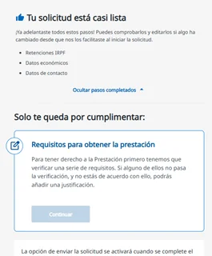

# Finalizar la solicitud

Con la certificación de riesgo positiva se habilita **Finalizar solicitud**: de inmediato si es positiva y, si es diferida, <code class="expression">space.vars.rel_dias_finalizar</code> antes de la [fecha de riesgo certificada](../../preguntas-frecuentes/fecha-de-riesgo-certificada.md).

## Completa y envía la solicitud 



### Pulsa Finalizar solicitud

En la página de tu solicitud, pulsa **Finalizar solicitud**.



### Revisa los datos que ya diste

Si al iniciar la solicitud añadiste la información opcional, como las retenciones del IRPF (modelo 145) o la información económica, aparece como completada. Puedes revisarla y cambiarla si algo ha cambiado desde entonces. Si no la añadiste, complétala ahora.

<figure></figure>



### Aporta la documentación para finalizar

Necesitas el certificado de suspensión del contrato de trabajo y el certificado de cotizaciones. Como con la declaración empresarial, puedes subir el documento o pulsar **Solicitar a mi empresa / asesoría**.

Tu empresa recibe un aviso por correo electrónico en la fecha en que puedes finalizar la solicitud, para que aporte la documentación en Ibermutua Digital o te la haga llegar.



### Envía la solicitud

Puedes revisar la documentación antes de confirmar el envío. En este paso no hace falta firmar: ya firmaste al iniciar la solicitud.



## Después de enviarla 

La solicitud queda pendiente de resolución. En **Histórico de mi solicitud** puedes consultar en todo momento la documentación que has aportado y su justificante. También recibes el justificante por correo electrónico.

## Más sobre el riesgo durante el embarazo o la lactancia 

**Preguntas frecuentes**



**También te puede interesar**


[Resolución de la prestación](resolucion.md)

