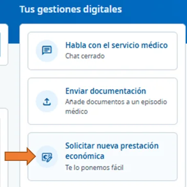
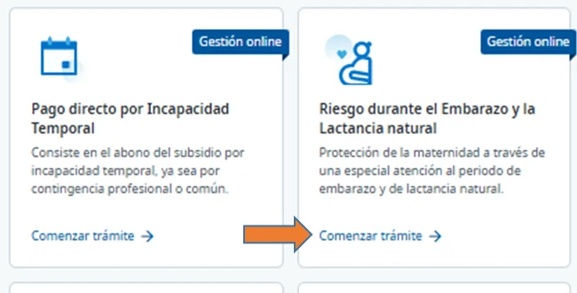
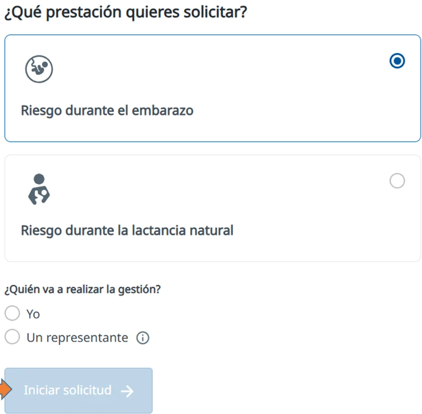
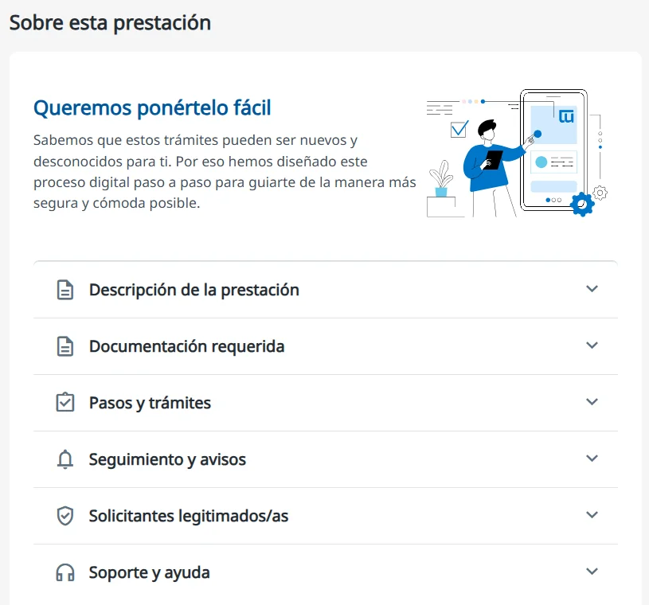
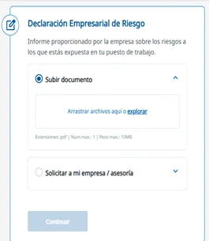
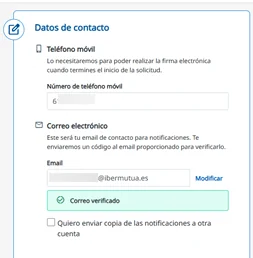
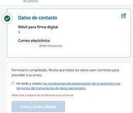

# Iniciar la solicitud

En esta fase abres el trámite, aportas la documentación de inicio y firmas la solicitud. Después, la mutua valora si existe riesgo: es la [certificación de riesgo](certificacion-de-riesgo.md).

## Abre el trámite 



### Abre una solicitud nueva



<figure></figure>



### Elige la prestación

En **Solicita tu prestación económica**, pulsa **Comenzar trámite** en **Riesgo durante el Embarazo y la Lactancia natural**.

<figure></figure>



### Elige el tipo y quién hace la gestión

En **¿Qué prestación quieres solicitar?**, elige **Riesgo durante el embarazo** o **Riesgo durante la lactancia natural**. En **¿Quién va a realizar la gestión?**, marca **Yo** y pulsa **Iniciar solicitud**.

<figure></figure>

En esta pantalla también tienes las fases del trámite y, en **Sobre esta prestación**, una guía con la documentación, los pasos y el seguimiento.

<figure></figure>



## Completa la solicitud 

La solicitud te guía por estos pasos:



### Revisa la verificación de requisitos

El sistema comprueba con los datos de la mutua que puedes pedir la prestación (afiliación y cobertura). Si detecta algún problema, te avisa y tienes que aportar un documento o justificante que lo corrija.



### Adjunta el informe médico

Adjunta el informe del Servicio Público de Salud que certifica tu embarazo. Te lo da tu médico/a de cabecera o tu ginecólogo/a del centro de salud o del hospital público.

Escribe también la fecha probable de parto que figura en el informe. Si no consta, puedes calcularla con la calculadora de fechas del formulario.

Si pides la prestación por lactancia, aporta también el certificado de maternidad.



### Aporta la declaración empresarial de riesgo

Es el informe de tu empresa sobre los riesgos de tu puesto de trabajo. Puedes aportarla de dos formas:

**A. Subir documento**: si tu empresa te ha dado la declaración en PDF, por correo electrónico o en papel (escaneada), adjúntala.

**B. Solicitar a mi empresa / asesoría**: se la pides a tu empresa desde [Ibermutua Digital](https://digital.ibermutua.es/), que se la comunica de forma automática.

Cuando se adjunta, el sistema lee los datos principales del documento. Si no puede leerlos, te pide que los escribas tal como aparecen en él.

<figure></figure>



### Añade la información adicional

Indica tu provincia, que es obligatoria porque determina el régimen fiscal. Si quieres, añade tus tareas, las medidas preventivas y otras empresas en las que trabajes, con documentación si la tienes.



### Completa la información económica

Indica el porcentaje de IRPF que quieres que se aplique y la cuenta bancaria para el abono. Si das la cuenta por primera vez o la cambias, adjunta un justificante bancario.



### Indica tus datos de contacto

Añade tu teléfono móvil, que se usa para la firma electrónica, y tu correo electrónico, que tendrás que verificar con el código que te enviamos. Son obligatorios: se usan para todas las notificaciones sobre la prestación.

<figure></figure>



### Firma y envía la solicitud

Revisa los datos, acepta las condiciones de presentación y el tratamiento de datos personales y pulsa **Firmar y enviar solicitud**.

<figure></figure>



## Después de enviarla 

Verás que la solicitud se ha enviado y que está pendiente de la certificación de riesgo. En **Histórico de mi solicitud** puedes ver y descargar el justificante de la documentación de cada fase. También recibes el justificante por correo electrónico.

## Más sobre el riesgo durante el embarazo o la lactancia 

**Preguntas frecuentes**



**También te puede interesar**


[Certificación de riesgo](certificacion-de-riesgo.md)

