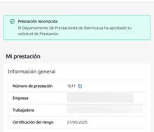

# Resolución de la prestación

Cuando el equipo de Prestaciones de Ibermutua revisa toda la documentación, aprueba o deniega la prestación y os lo notifica por correo electrónico a ti y a tu empresa.

## Consulta la resolución 

En la página de tu solicitud ves el estado de la prestación. Si se reconoce, aparece **Prestación reconocida** y, en **Mi prestación**, sus datos.

<figure></figure>

En **Histórico de mi solicitud** ves todos los pasos del trámite y puedes ver y descargar la documentación que se ha generado.

Cuando empieces a cobrar, puedes [consultar tus pagos](../consultar-tus-pagos.md).

## Si no estás de acuerdo 

Puedes reclamar contra la resolución desde Ibermutua Digital. Consulta [cómo reclamar una resolución](../reclamar-una-resolucion.md).

## Más sobre el riesgo durante el embarazo o la lactancia 

**Preguntas frecuentes**



**También te puede interesar**


[Consultar tus pagos](../consultar-tus-pagos.md)

