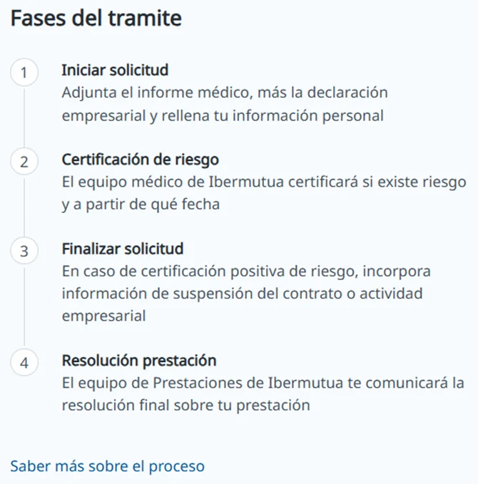
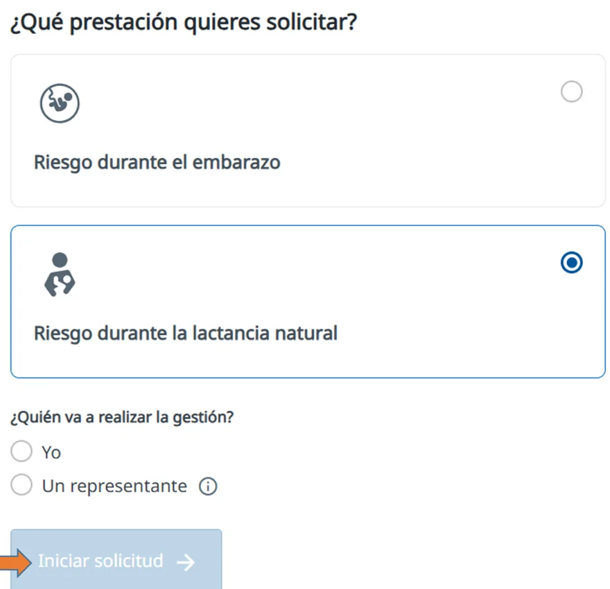

# Solicitar la prestación por riesgo durante el embarazo o la lactancia

Puedes solicitar online la [prestación por riesgo durante el embarazo o la lactancia natural](https://www.ibermutua.es/tramite/riesgo-durante-embarazo/). Un formulario te guía y te indica qué información y qué documentos necesitas en cada paso.

## Fases del trámite 

La solicitud pasa por cuatro fases. En cada una, la pantalla te indica en qué punto estás.



### Inicia la solicitud

Adjuntas el informe médico y la declaración empresarial de riesgo, y completas tus datos. Consulta [cómo iniciar la solicitud](iniciar-la-solicitud.md).



### Espera la certificación de riesgo

El equipo médico de Ibermutua valora si existe riesgo en tu puesto de trabajo y desde qué fecha. Consulta [en qué consiste la certificación](certificacion-de-riesgo.md).



### Finaliza la solicitud

Si la certificación es positiva, añades la documentación de la suspensión del contrato o de la actividad y los datos que falten. Consulta [cómo finalizar la solicitud](finalizar-la-solicitud.md).



### Recibe la resolución

El equipo de Prestaciones de Ibermutua te comunica si te reconoce la prestación. Consulta [la resolución de la prestación](resolucion.md).



<figure></figure>

## Si la pides por lactancia 

Los pasos son los mismos que en el embarazo, con estas diferencias:

* Puedes pedirla a partir de la <code class="expression">space.vars.rel_lactancia_semana</code> del parto, o de la <code class="expression">space.vars.rel_lactancia_semana_multiple</code> si fue un embarazo múltiple.
* Con el informe médico tienes que aportar también el certificado de maternidad.
* La certificación de riesgo solo puede ser positiva o negativa: no hay certificación diferida.

Al empezar, en **¿Qué prestación quieres solicitar?**, elige **Riesgo durante la lactancia natural**.

<figure></figure>

## Más sobre el riesgo durante el embarazo o la lactancia 

**Preguntas frecuentes**



**También te puede interesar**


[Iniciar la solicitud](iniciar-la-solicitud.md)

