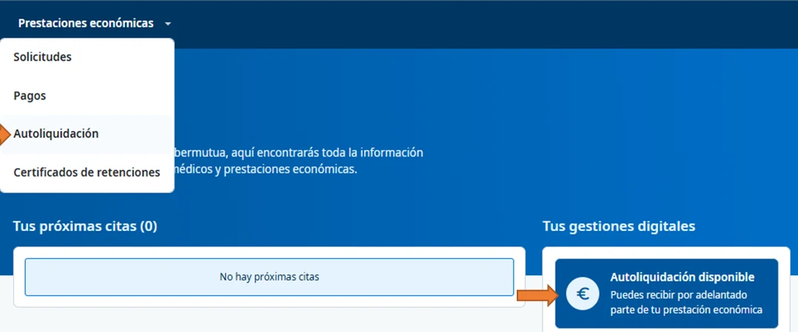
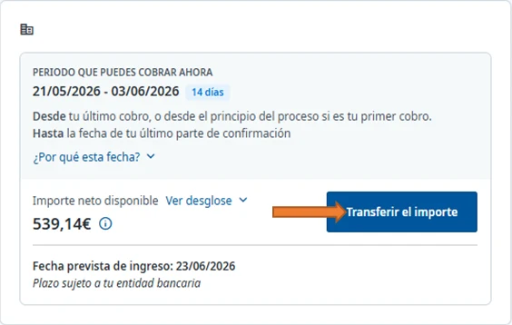
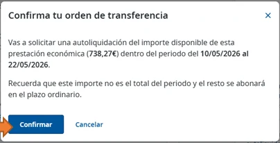
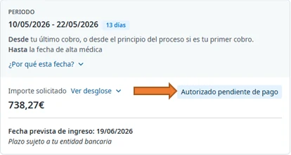

# Solicitar la autoliquidación



Se pide en Ibermutua Digital Personas, en **Prestaciones económicas** > **Autoliquidación**. Si no la pides, Ibermutua te paga lo generado en los últimos días de cada mes.



Si no puedes solicitarla, consulta [por qué no puedes solicitar la autoliquidación](../preguntas-frecuentes/no-puedo-solicitar-la-autoliquidacion.md).

## Pide la autoliquidación 





### Abre Autoliquidación

Entra en [Ibermutua Digital Personas](https://personas.ibermutua.es/) y, en el menú superior, pulsa **Prestaciones económicas** > **Autoliquidación**. Cuando puedes pedirla, también aparece **Autoliquidación disponible** en **Tus gestiones digitales**, en la página de inicio.

<figure></figure>



### Revisa el periodo y el importe

En **Periodo que puedes cobrar ahora** verás las fechas que se pagan y, en **Importe neto disponible**, la cantidad. Si quieres, puedes pulsar **¿Por qué esta fecha?** para saber por qué el periodo termina ese día, o **Ver desglose** para ver el detalle del importe.

<figure></figure>

Si el periodo o el importe no son los que esperas, consulta a tu tramitador/a antes de seguir. En esta pantalla, su teléfono está a la derecha, en **Contacta con el tramitador de tu prestación económica**.





### Confirma la transferencia

Pulsa **Transferir el importe**. En **Confirma tu orden de transferencia**, revisa el importe y el periodo y pulsa **Confirmar**. Verás **Solicitud enviada correctamente** y te llegará un correo electrónico con los detalles.

<figure></figure>





Pendiente de confirmar si la autoliquidación se puede pedir desde la app y con qué pasos.

<figure></figure>



## Cuándo cobras y cómo sigues la solicitud 

El ingreso llega en un plazo máximo de <code class="expression">space.vars.autoliquidacion_plazo_abono</code> desde que confirmas; según la hora de la solicitud, puede llegar al día siguiente. En **Fecha prevista de ingreso** verás el día estimado, que también depende de tu banco.

Para seguir la solicitud, vuelve a **Autoliquidación**: verás el importe solicitado y su estado, por ejemplo **Autorizado pendiente de pago**. Cuando se paga, aparece en [tus pagos](https://soporte-ibermutua-digital.scroll.site/soporte-ibermutua-digital/pagos).



<figure></figure>



<figure></figure>



## Más sobre la autoliquidación 

**Preguntas frecuentes**


