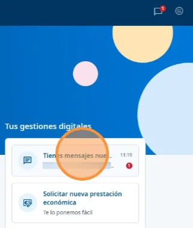
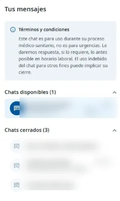
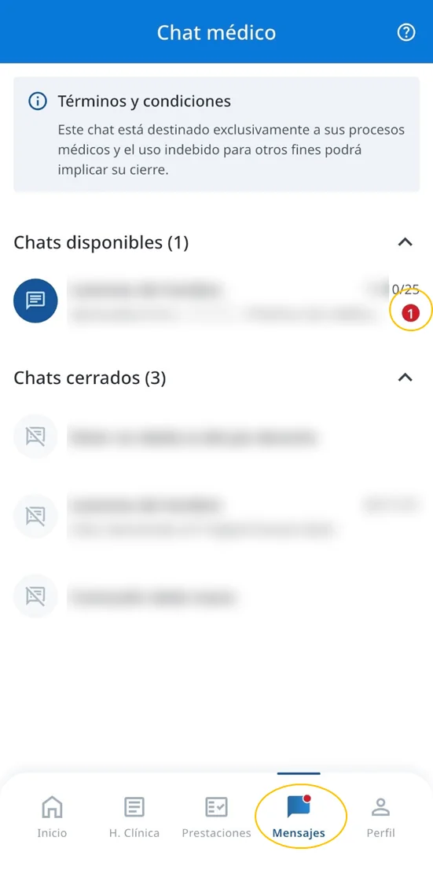
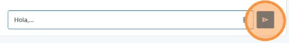

# Hablar con el servicio médico por chat

Con el chat puedes escribir al servicio médico de Ibermutua durante tu baja médica, desde el ordenador o desde el móvil. Toda la conversación queda guardada.



## Abre el chat 



En la página de inicio, pulsa el icono del chat, arriba a la derecha, o la opción del chat en **Tus gestiones digitales**. También puedes abrirlo desde el propio episodio médico.

<figure></figure>

En **Tus mensajes** verás los chats disponibles y los cerrados.

<figure></figure>



Pulsa **Mensajes** en la barra inferior. Arriba verás los chats disponibles y los cerrados.

<figure></figure>



## Escribe al servicio médico 



### Elige el chat

En **Chats disponibles**, pulsa el chat del episodio sobre el que quieres preguntar.



### Escribe y envía tu mensaje

Escribe en **Escribe un mensaje aquí** y pulsa el botón de enviar, a la derecha.

<figure></figure>



### Espera la respuesta

La respuesta no es inmediata: consulta [cuándo responde el servicio médico](../preguntas-frecuentes/cuando-responden-el-chat.md). Cuando el servicio médico te responde, verás un aviso de mensajes sin leer: un punto rojo en el icono del chat o, en la app, en **Mensajes**.



Los chats cerrados solo se pueden consultar: consulta [cuándo se cierra un chat](../preguntas-frecuentes/cuando-se-cierra-un-chat.md). Si tu consulta no es médica, consulta [qué canal usar](../canales-de-atencion.md).

## Más sobre el chat 

**Preguntas frecuentes**



**También te puede interesar**


[Enviar documentación a la mutua](enviar-documentacion.md)

