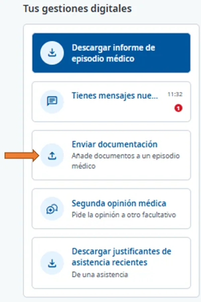
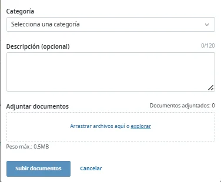
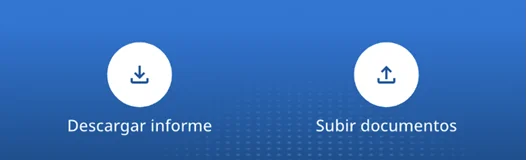
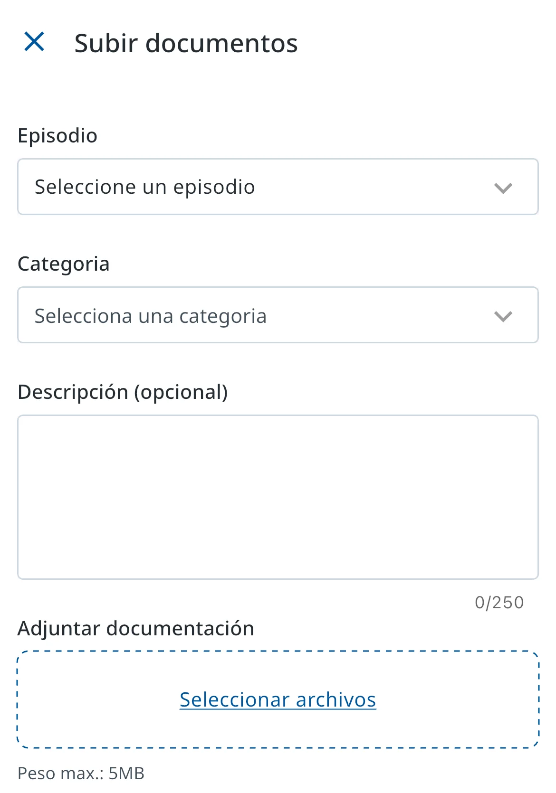

# Enviar documentación a la mutua

Puedes enviar al servicio médico de la mutua, de forma cómoda y segura, cualquier documento que te pidan o que quieras hacerle llegar. Se guarda en tu historia clínica, y tu médico/a y tú podéis consultarlo en todo momento.

## Envía la documentación 





### Abre Enviar documentación

En **Tus gestiones digitales**, pulsa **Enviar documentación**. Lo encontrarás en la página de inicio y en la ficha de cada episodio médico. También puedes entrar desde un episodio médico activo de tu historia clínica, en su sección **Documentos**.

<figure></figure>



### Rellena el formulario y adjunta el documento

Indica la **Categoría** del documento y el episodio al que se refiere (si lo abres desde un episodio, ya aparece) y, si quieres, añade una descripción. En **Adjuntar documentos**, arrastra el archivo o pulsa **explorar** para elegirlo desde tu equipo o desde cualquier dispositivo o servicio de almacenamiento.

<figure></figure>



### Envía

Pulsa **Subir documentos**.







### Abre Subir documentos

En el menú inferior, pulsa **H. Clínica** y, arriba, **Subir documentos**. Desde la ficha de un episodio, el botón es **Enviar documentos**.

<figure></figure>



### Rellena el formulario y adjunta el documento

Elige el **Episodio** y la **Categoría** y, si quieres, añade una descripción. En **Adjuntar documentación**, pulsa **Seleccionar archivos**.

<figure></figure>



### Envía

Pulsa **Enviar solicitud**.





## Qué pasa después 

La documentación se carga en tu historia clínica para que el servicio médico de la mutua la valide. En tus documentos puedes ver por separado [la que has subido tú y la que ha incorporado la mutua](../tu-historia-clinica/consultar-documentacion-administrativa.md#documentacion-filtrar).

Una vez validada, ya no puedes eliminarla de tu historia clínica desde Ibermutua Digital Personas.

## Más sobre la documentación 

**Preguntas frecuentes**



**También te puede interesar**


[Consultar la documentación administrativa](../tu-historia-clinica/consultar-documentacion-administrativa.md)

