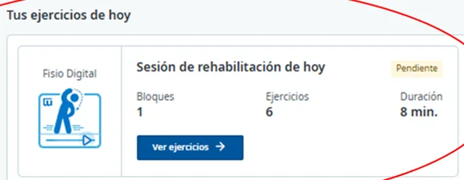
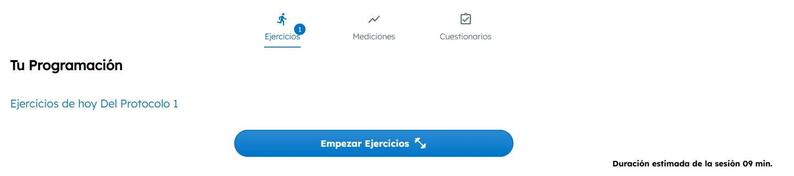
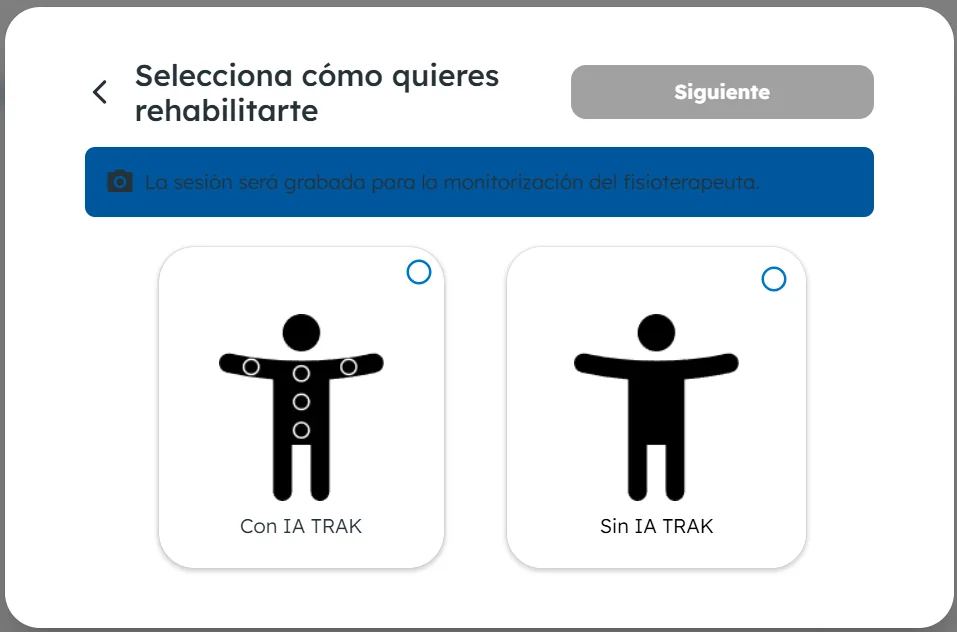
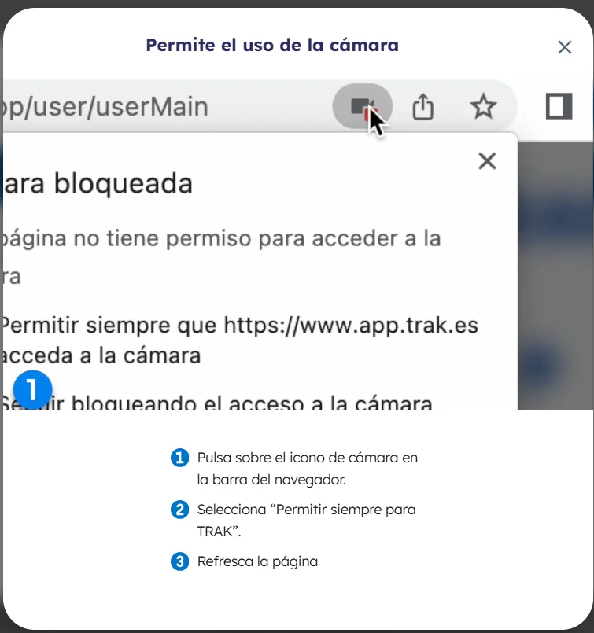
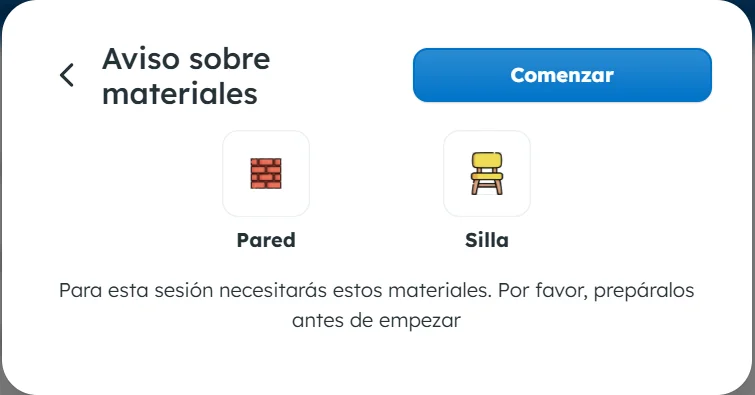
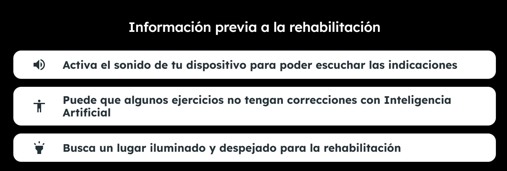
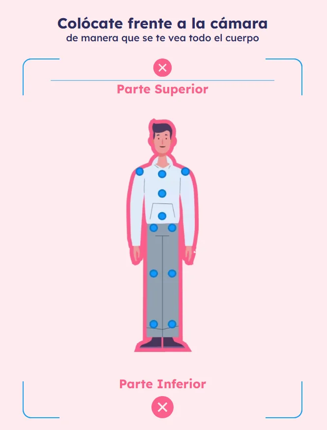
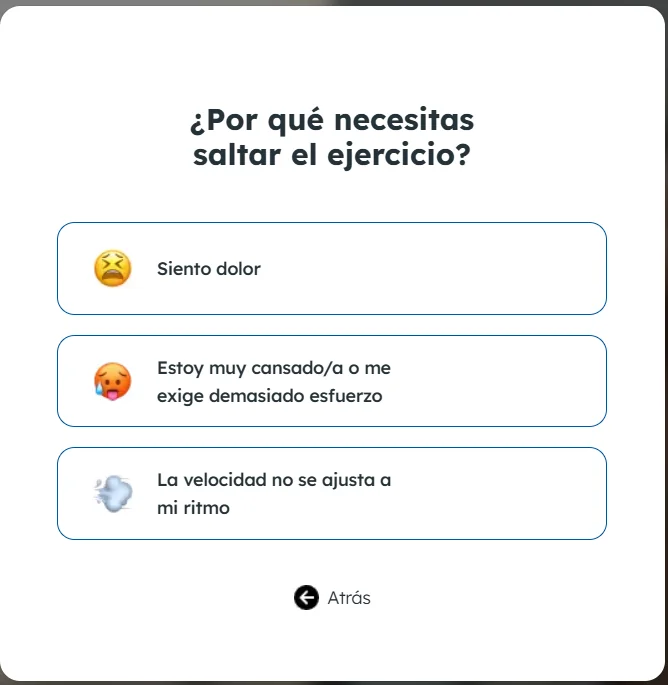
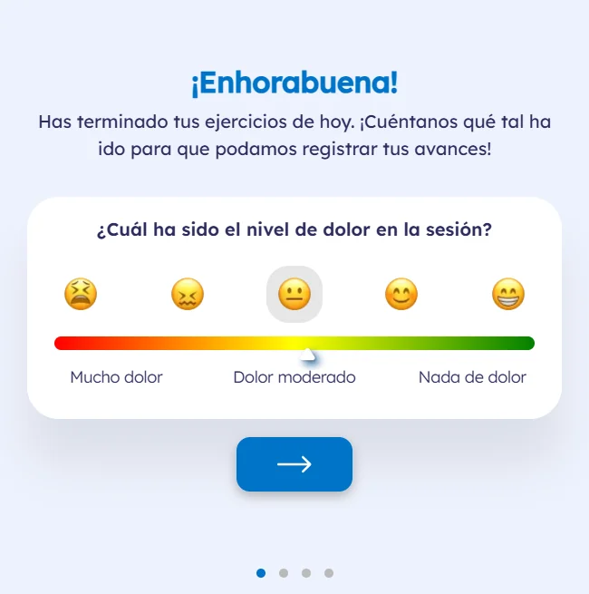

# Hacer tu rehabilitación online

Si tu fisioterapeuta te ha pautado ejercicios, puedes hacer tu rehabilitación desde casa con Fisio Digital. Tu fisioterapeuta sigue tu evolución y ajusta el tratamiento.


**Haz solo los ejercicios pautados.** Detén la sesión si notas señales de alarma y contacta con tu equipo asistencial si empeoras.


## Haz los ejercicios de hoy 



### Abre tus ejercicios de hoy

En la página de inicio de [Ibermutua Digital Personas](https://personas.ibermutua.es/), en **Tus ejercicios de hoy**, verás la sesión con su estado, los bloques, los ejercicios y la duración. Pulsa **Ver ejercicios**.

<figure></figure>



### Empieza la sesión

En **Tu Programación** verás los ejercicios de hoy y la duración estimada de la sesión. Pulsa **Empezar Ejercicios**.

<figure></figure>



### Elige con o sin inteligencia artificial

Elige **Con IA TRAK**, que te guía en los ejercicios cuando es posible, o **Sin IA TRAK**, que va más fluido si has tenido problemas de lentitud. Pulsa **Siguiente**. La sesión se graba para que tu fisioterapeuta pueda seguir tu evolución.

<figure></figure>



### Permite el uso de la cámara

Si el navegador te lo pide, pulsa el icono de la cámara en su barra de direcciones, elige **Permitir siempre** para TRAK y recarga la página.

<figure></figure>



### Prepara el espacio y los materiales

Antes de empezar verás los materiales que necesitas para la sesión y unas recomendaciones: activa el sonido para escuchar las indicaciones y busca un lugar iluminado y despejado. Pulsa **Comenzar**.

<figure></figure>

<figure></figure>



### Colócate frente a la cámara

Ponte de forma que la cámara vea todo tu cuerpo.

<figure></figure>



### Haz los ejercicios

A la izquierda verás cómo se hace cada ejercicio y, a la derecha, tu imagen con el número de repeticiones. Si un ejercicio te duele, te exige demasiado esfuerzo o su velocidad no se ajusta a tu ritmo, puedes saltarlo. Si es la velocidad, también puedes ajustarla.

<figure></figure>



### Valora la sesión

Al terminar, indica el nivel de dolor, el esfuerzo que te ha supuesto la sesión y si notas mejoría. Si quieres, añade comentarios para tu especialista.

<figure></figure>



## Más sobre la rehabilitación online 

**Preguntas frecuentes**


