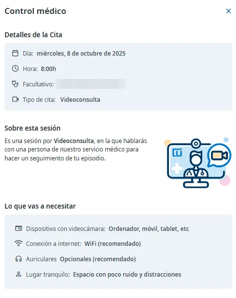
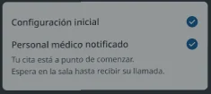
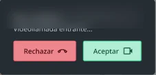

# Hacer una videoconsulta

Si tu médico/a lo considera oportuno, puedes hacer tus revisiones y el seguimiento médico por videoconsulta. La cita aparece en [tus próximas citas](../citas-y-asistencias/consultar-tus-citas.md) como cualquier otra, con el tipo **Videoconsulta**.

Antes de la cita, comprueba [qué necesitas para la videoconsulta](../preguntas-frecuentes/que-necesito-para-una-videoconsulta.md).

## Consulta los detalles de la cita 

Al pulsar la cita verás el día, la hora, el facultativo y lo que vas a necesitar. Desde ahí también puedes añadirla a tu calendario.



En la página de inicio, pulsa la cita en **Tus próximas citas**.



En la pantalla de inicio, pulsa la cita en **Tus próximas citas**.

<figure></figure>



## Entra en la videoconsulta 

La sala se abre 5 minutos antes de la hora de la cita y te avisamos por SMS.





### Entra en la sala

Cuando se abra la sala, entra desde la cita.



### Espera en la sala

El sistema comprueba que la cámara y el micrófono tienen permiso y que la conexión es adecuada. Si hay algún error, te lo indica para que lo corrijas. Cuando todo está bien, tu médico/a recibe un aviso de que estás en la sala: espera a que te llame.

<figure></figure>



### Acepta la videollamada

Cuando tu médico/a te llame, verás **Videollamada entrante**: pulsa **Aceptar** para empezar la videoconsulta.

<figure></figure>





Pendiente de confirmar cómo se entra en la sala y se acepta la videollamada desde la app.

<figure></figure>



## Más sobre la videoconsulta 

**Preguntas frecuentes**



**También te puede interesar**


[Consultar tus citas](../citas-y-asistencias/consultar-tus-citas.md)

