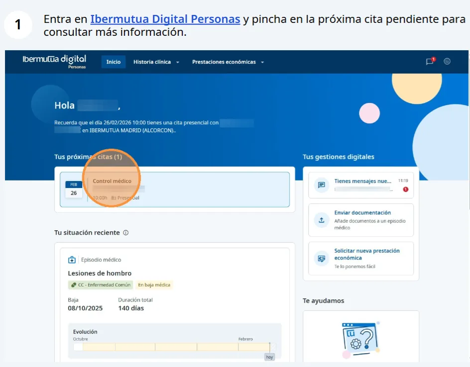
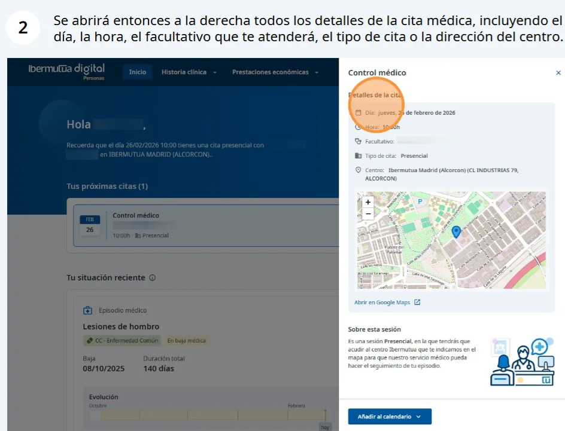
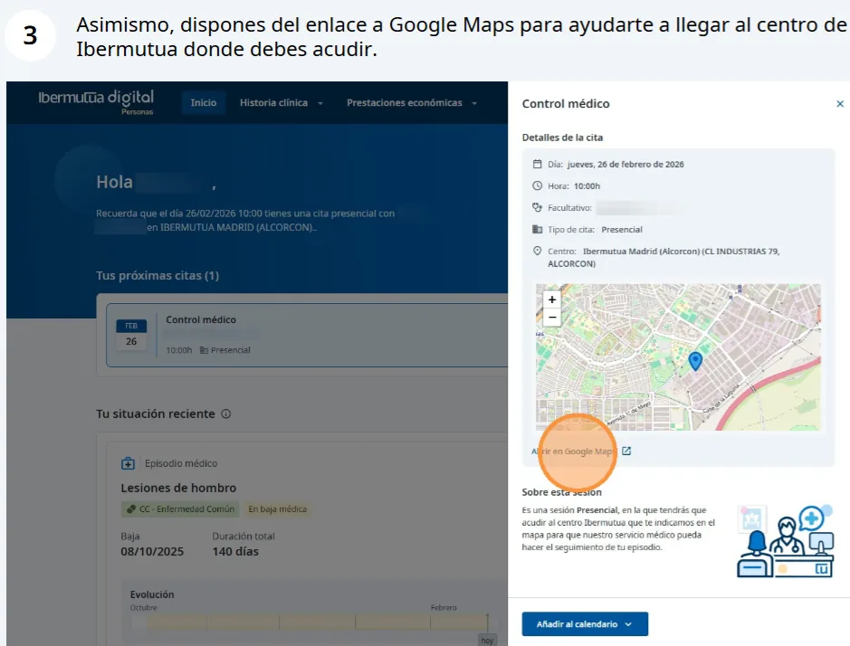
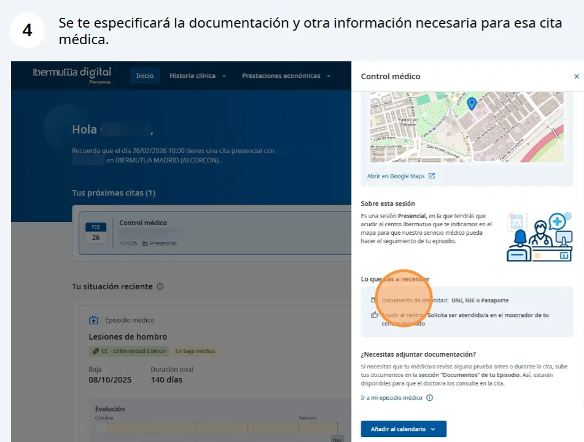
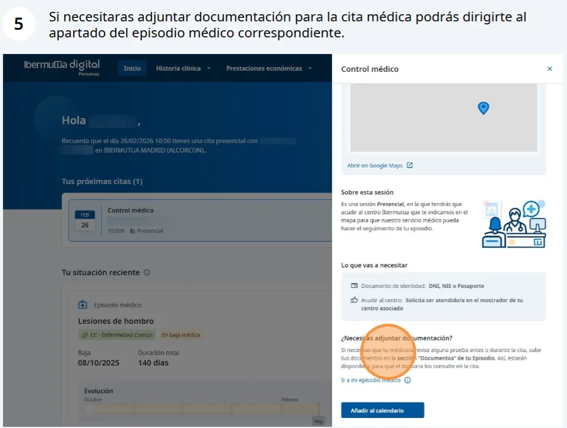
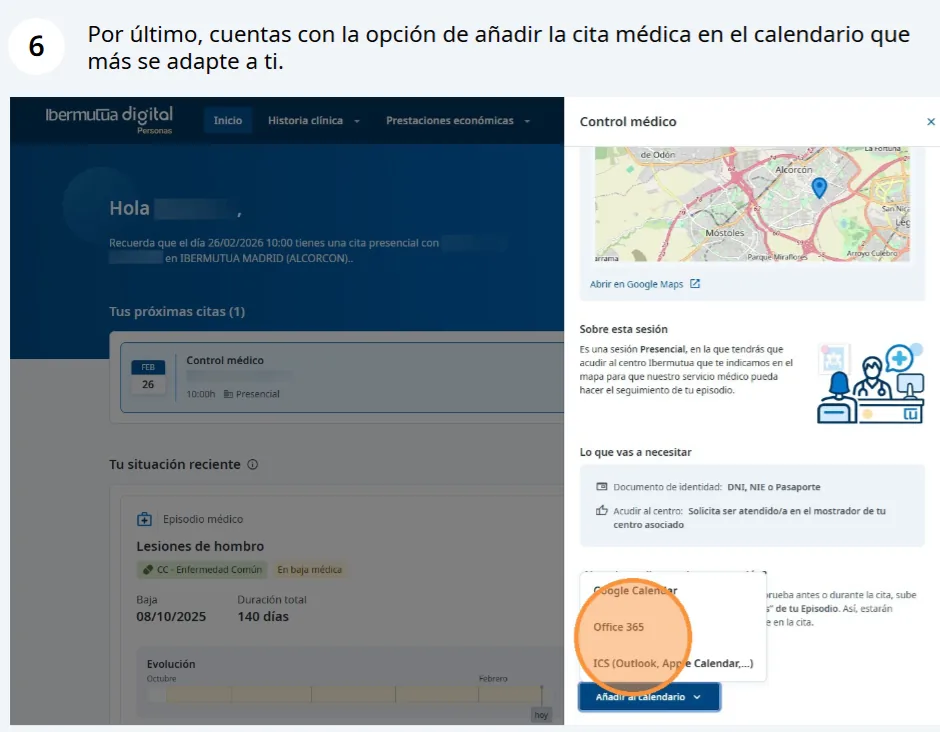
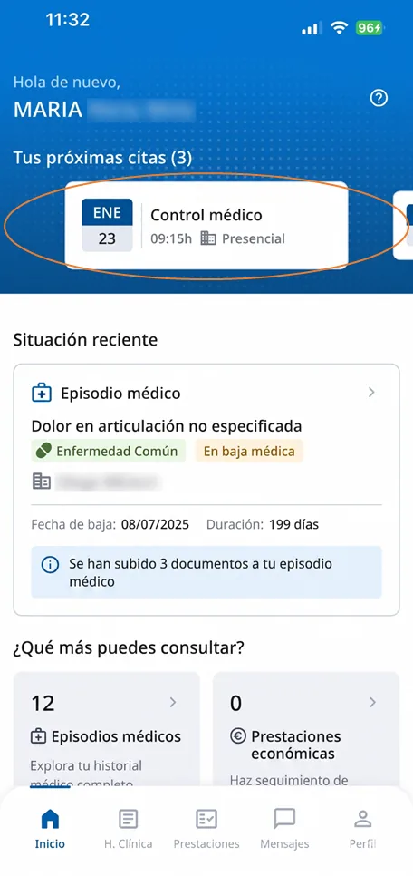

# Consulta de Citas Pendientes

Desde la página principal de [**Ibermutua Digital Personas**](https://personas.ibermutua.es/), se mostrará un aviso con las próximas citas programadas en la parte superior, tanto en la versión web como en la aplicación móvil.  




<figure><figcaption>
1. Entra en Ibermutua Digital Personas y pincha en la próxima cita pendiente para consultar más información.
</figcaption></figure>

<figure><figcaption>
2. A la derecha se abren los detalles de la cita: día, hora, facultativo, tipo de cita y dirección del centro.
</figcaption></figure>

<figure><figcaption>
3. Enlace a Google Maps para llegar al centro de Ibermutua.
</figcaption></figure>

<figure><figcaption>
4. Documentación e información necesarias para la cita.
</figcaption></figure>

<figure><figcaption>
5. Si necesitas adjuntar documentación, ve al episodio médico correspondiente.
</figcaption></figure>

<figure><figcaption>
6. Añade la cita al calendario que prefieras.
</figcaption></figure>



<figure><figcaption>
App: aviso de próximas citas en la pantalla de inicio.
</figcaption></figure>



## Preguntas frecuentes relacionadas

* [Preguntas sobre Historia Clínica y Asistencias Médicas](../preguntas-frecuentes/preguntas-sobre-historia-clinica-y-asistencias-medicas/README.md)
* [¿Puedo cambiar las citas desde Ibermutua Digital?](../preguntas-frecuentes/preguntas-sobre-historia-clinica-y-asistencias-medicas/puedo-cambiar-las-citas-desde-ibermutua-digital.md)
