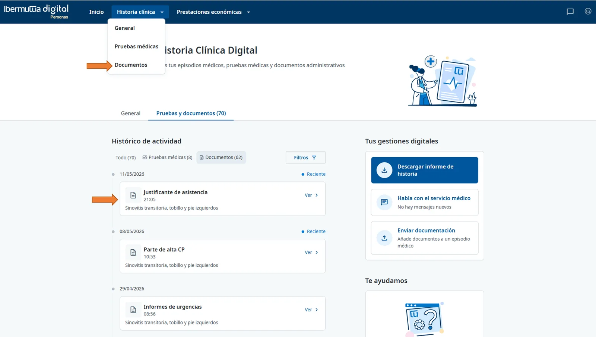
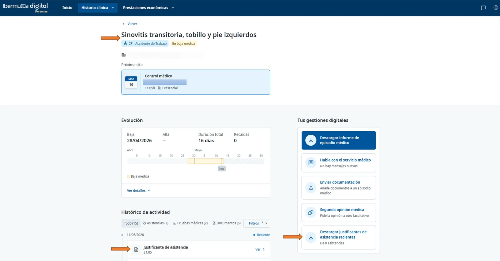

# Justificantes de Asistencia

El justificante de asistencia es un documento oficial emitido por Ibermutua que acredita la presencia del trabajador/a en una cita, prueba o gestión sanitaria. Suele utilizarse para justificar ausencias laborales ante la empresa.


Formato del documento: PDF descargable desde Ibermutua Digital.

Usos habituales: justificar asistencia a consultas, pruebas diagnósticas, tratamientos o trámites clínicos.


## Instrucciones paso a paso

1. **Accede a Ibermutua Digital:** Introduce tus credenciales (DNI y contraseña) en el portal.

2. **Navega por el menú superior:** Selecciona Historia Clínica.

3. **Abre la sección de documentos:** Haz clic en "Documentos".

4. **Localiza el documento:** Busca el justificante de asistencia que necesites en el listado. Puedes usar filtros por tipo de documento o fecha para acelerar la búsqueda.

5. **Entra en la ficha de detalle:** Haz clic sobre el documento para abrir su ficha y revisar la información.

6. **Descarga el PDF:** En la parte inferior de la ficha, selecciona "Descargar documento" para guardar el justificante en tu dispositivo.

<figure> Documentos con un Justificante de asistencia señalado en el histórico de actividad."><figcaption>
Web: justificante de asistencia en Documentos.
</figcaption></figure>


Consejo: renombra el archivo al guardarlo (por ejemplo, "Justificante_asistencia_Apellido_Nombre.pdf") para localizarlo fácilmente más adelante.


## Alternativa: dentro del Episodio Médico

a) Entra dentro del Episodio Médico de interés que puede estar dentro de "Tu situación reciente" o bien en "Historia clínica".

b) Aquí podrás darle a "Ver", dentro del "Justificante de asistencia" asociado, y descargar el PDF correspondiente o, incluso, en el menú de la derecha dentro de "Tus gestiones digitales" optar por "Descargar justificantes de asistencia recientes" donde, en formato ZIP, dispondrás de los últimos justificantes de asistencia.

<figure><figcaption>
Web: justificantes desde el episodio médico y descarga de los más recientes.
</figcaption></figure>

## Buenas prácticas

* Verifica que el documento muestre correctamente fecha, hora y centro asistencial antes de enviarlo a tu empresa.

* Conserva una copia de seguridad en un repositorio corporativo seguro o en tu gestor de documentos.

* Si necesitas varios justificantes (p. ej., diferentes pruebas el mismo día), descarga cada uno desde su ficha correspondiente.

## Solución de incidencias

¿Dónde está exactamente el justificante dentro de Ibermutua Digital?

Habitualmente, dentro de "Historia Clínica", al abrir el episodio verás un apartado de "Documentos". Ahí suele figurar el "Justificante de asistencia" que podrás descargar.

¿En qué formato se descarga?

PDF firmado digitalmente. Conserva el archivo original para mantener su validez y trazabilidad.

¿Puedo descargar justificantes de fechas pasadas?

Sí, siempre que el episodio o la asistencia consten en tu historial. Usa los filtros por rango de fechas para localizarlo.

No encuentro el justificante en “Pruebas y documentos”

- Revisa los filtros por fecha o tipo de documento y amplía el rango temporal.

- Comprueba si el documento puede estar clasificado como informe de consulta o prueba asociada a la cita.

- Actualiza la página o vuelve a iniciar sesión.

El botón “Descargar documento” no aparece

Asegúrate de haber entrado en la ficha de detalle del documento, no solo en el listado.

El PDF no abre o se descarga corrupto

- Prueba con otro navegador o borra la caché del actual.

- Descarga de nuevo conectándote a una red estable.

- Comprueba que tu visor de PDF esté actualizado.

Necesito el justificante con una fecha o detalle específico

Revisa la ficha de la cita exacta correspondiente a ese día y descarga el documento asociado a esa atención.


**Seguridad y privacidad:**

* Los justificantes contienen datos de salud. Compártelos solo con destinatarios autorizados.

* No edites ni alteres el PDF. Cualquier modificación puede invalidar la validez del justificante.

* Evita enviarlo por canales no seguros; prioriza medios cifrados o las vías indicadas por tu empresa.


## Dudas frecuentes

¿Puedo solicitar un justificante de días pasados si no aparece?

Si el justificante no figura en el portal, contacta con soporte de Ibermutua o con tu centro asistencial para verificar su emisión y publicación.

¿Sirve el justificante digital en PDF para mi empresa?

En la mayoría de los casos, sí. El PDF emitido por Ibermutua es válido como acreditación de asistencia. Consulta las políticas de tu empresa si requieren un canal de envío específico.

¿Puedo descargarlo desde el móvil?

Sí, siempre que puedas acceder a Ibermutua Digital desde un navegador móvil compatible o a través de la [app](https://soporte-ibermutua-digital.scroll.site/soporte-ibermutua-digital/alta-a-traves-de-la-app).

---
## Preguntas frecuentes relacionadas

* [Preguntas sobre Historia Clínica y Asistencias Médicas](../preguntas-frecuentes/preguntas-sobre-historia-clinica-y-asistencias-medicas/README.md)
* [¿Cómo descargar un justificante de asistencia?](../preguntas-frecuentes/preguntas-sobre-historia-clinica-y-asistencias-medicas/como-descargar-un-justificante-de-asistencia.md)
