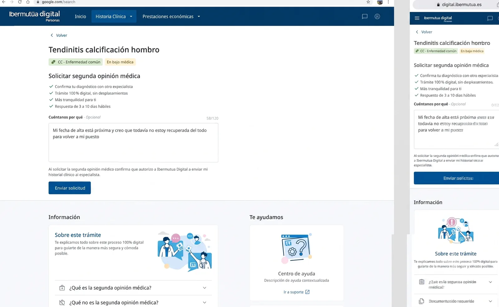
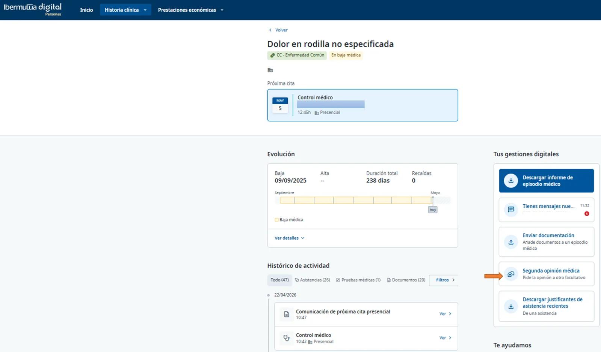
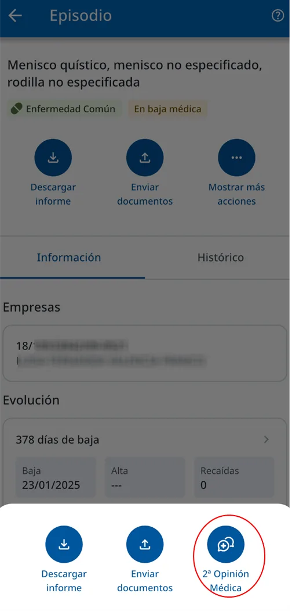
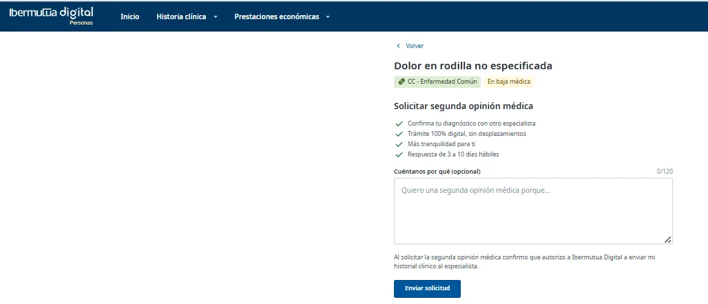
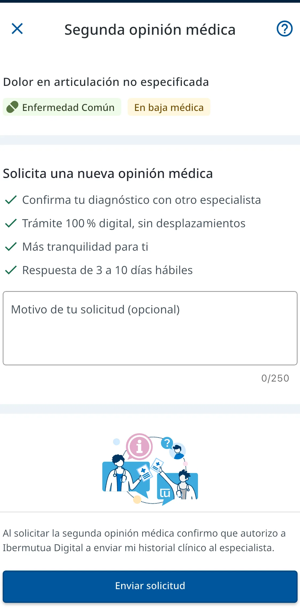
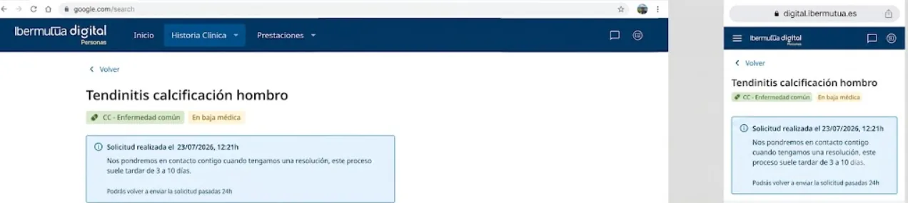

# Solicitud de Segunda Opinión Médica

Puedes solicitar una segunda opinión médica online, a través de [**Ibermutua digital Personas**](https://personas.ibermutua.es/) o bien de forma presencial, en cualquier [**centro**](https://www.ibermutua.es/red-de-centros/) de Ibermutua.

La [segunda opinión médica](../preguntas-frecuentes/preguntas-sobre-historia-clinica-y-asistencias-medicas/que-es-la-segunda-opinion-medica.md) es la **valoración realizada por un médico experto sobre el diagnóstico, pronóstico, tratamiento y orientaciones de futuro de un proceso clínico de un paciente.**

<figure><figcaption>
Solicitud de segunda opinión médica en web y móvil.
</figcaption></figure>

## 1. Acceso al formulario de solicitud



Accede desde el lateral derecho dentro del episodio en tu historia clínica \> **Historia Clínica \> General \> Episodio \> Segunda Opinión Médica.**

<figure><figcaption>
Web: Segunda opinión médica, en el menú derecho del episodio.
</figcaption></figure>


Accede a la opción de Historia Clínica, una vez dentro, pulsa en el proceso médico correspondiente, en "Mostrar más acciones" y elige "Segunda Opinión Médica".

<figure><figcaption>
App: Mostrar más acciones > 2ª Opinión Médica.
</figcaption></figure>



## 2. Cumplimentación de la solicitud



Una vez en la página de la solicitud se ha seleccionado automáticamente el episodio para el que se quiere solicitar esta segunda opinión, donde podrás contarnos, de forma opcional, por qué deseas realizar esta gestión.

<figure><figcaption>
Web: formulario de solicitud.
</figcaption></figure>


En primer lugar, debe seleccionarse el episodio para el que se quiere solicitar la segunda opinión médica.

<figure><figcaption>
App: formulario de solicitud.
</figcaption></figure>



Nos pondremos en contacto contigo en un plazo de 3 a 10 días para atender la solicitud.

<figure><figcaption>
Confirmación de la solicitud enviada.
</figcaption></figure>

## Preguntas frecuentes relacionadas

* [Preguntas sobre Historia Clínica y Asistencias Médicas](../preguntas-frecuentes/preguntas-sobre-historia-clinica-y-asistencias-medicas/README.md)
* [¿Qué es la segunda opinión médica?](../preguntas-frecuentes/preguntas-sobre-historia-clinica-y-asistencias-medicas/que-es-la-segunda-opinion-medica.md)
