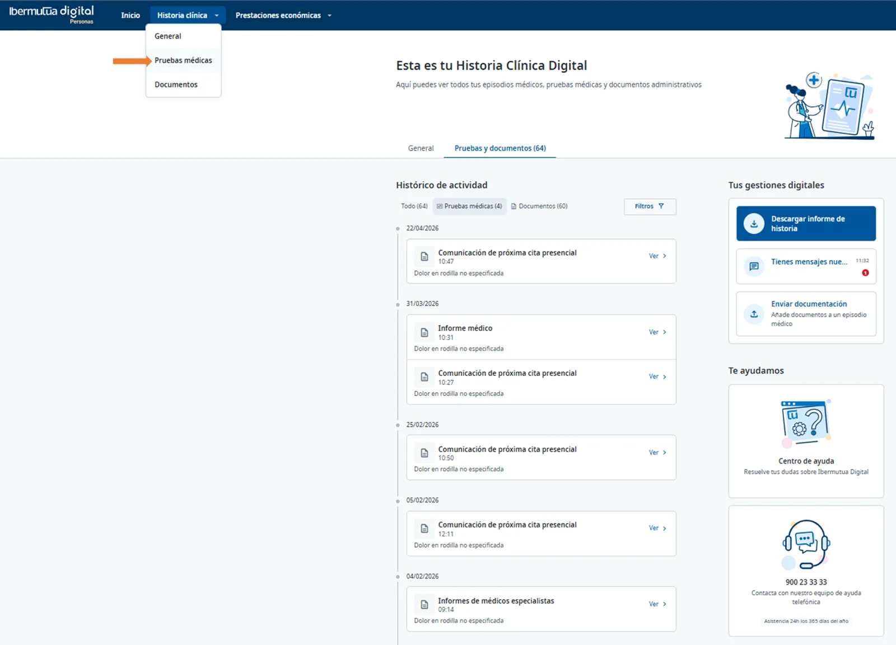
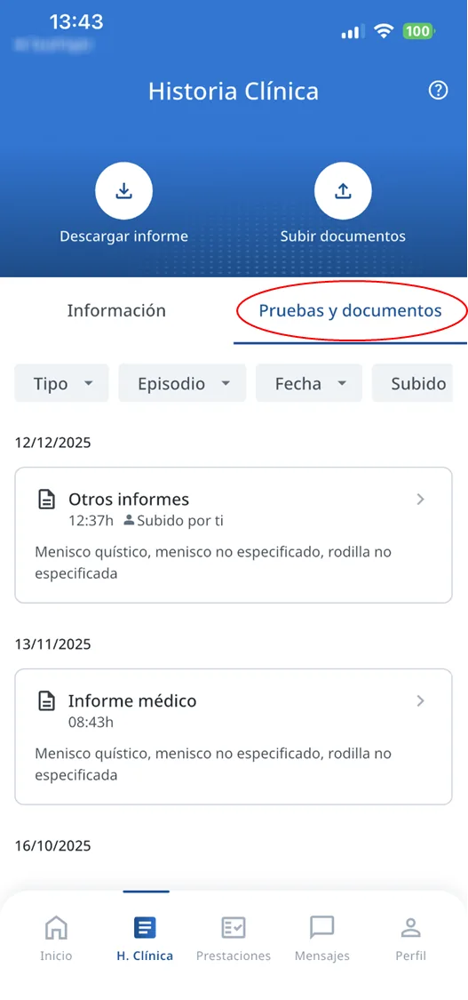
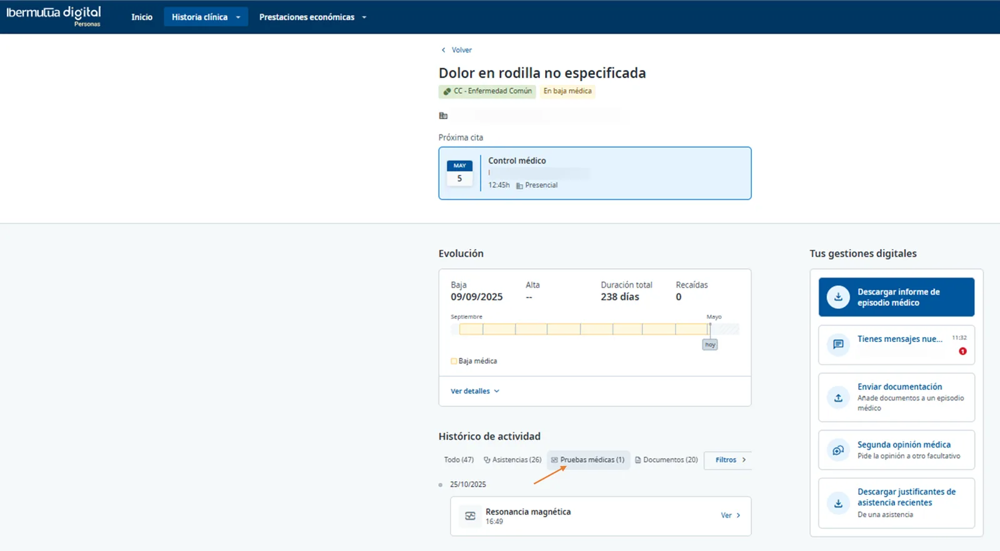
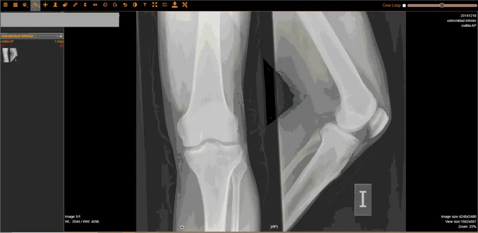

# Visualización de Pruebas Diagnósticas

## 1. Consulta de todas las pruebas diagnósticas de la Historia Clínica

Puedes visualizar todas tus pruebas diagnósticas realizadas con Ibermutua a través del menú superior: **Historia Clínica \> Pruebas médicas/Pruebas y documentos**  




<figure> Pruebas médicas señalado con una flecha; pestaña Pruebas y documentos con el histórico de actividad."><figcaption>
Web: Historia Clínica > Pruebas médicas.
</figcaption></figure>



<figure><figcaption>
App: pestaña Pruebas y documentos.
</figcaption></figure>



## 2. Consulta de pruebas diagnósticas por Episodio Médico

Otra forma de consulta es [ir a un episodio médico concreto](README.md) y, desde ahí, consultar exclusivamente las pruebas de dicho episodio.  




<figure><figcaption>
Web: pruebas de un episodio concreto, filtrando por Pruebas médicas.
</figcaption></figure>



<figure><figcaption>
App: pruebas y documentos del episodio.
</figcaption></figure>



## 3. Visualización de las pruebas diagnósticas de imagen

Las pruebas diagnósticas de imagen (radiografía, resonancia magnética, TAC, etc.) se muestran a través de un visor especial que permite un análisis detallado con capacidad diagnóstica.

<figure><figcaption>
Visor de pruebas diagnósticas de imagen.
</figcaption></figure>

## Preguntas frecuentes relacionadas

* [Visualización de Pruebas Diagnósticas](visualizacion-de-pruebas-diagnosticas.md)
* [Preguntas sobre Historia Clínica y Asistencias Médicas](../preguntas-frecuentes/preguntas-sobre-historia-clinica-y-asistencias-medicas/README.md)
* [¿Cuándo están disponibles en Ibermutua Digital las pruebas diagnósticas?](../preguntas-frecuentes/preguntas-sobre-historia-clinica-y-asistencias-medicas/cuando-estan-disponibles-en-ibermutua-digital-las-pruebas-diagnosticas.md)
* [¿Qué es la segunda opinión médica?](../preguntas-frecuentes/preguntas-sobre-historia-clinica-y-asistencias-medicas/que-es-la-segunda-opinion-medica.md)
* [¿Qué diferencia hay entre informe de Historia Clínica e Informe de Episodio Médico?](../preguntas-frecuentes/preguntas-sobre-historia-clinica-y-asistencias-medicas/que-diferencia-hay-entre-informe-de-historia-clinica-e-informe-de-episodio-medico.md)
* [¿Qué tipo de pruebas diagnósticas puedo visualizar?](../preguntas-frecuentes/preguntas-sobre-historia-clinica-y-asistencias-medicas/que-tipo-de-pruebas-diagnosticas-puedo-visualizar.md)
