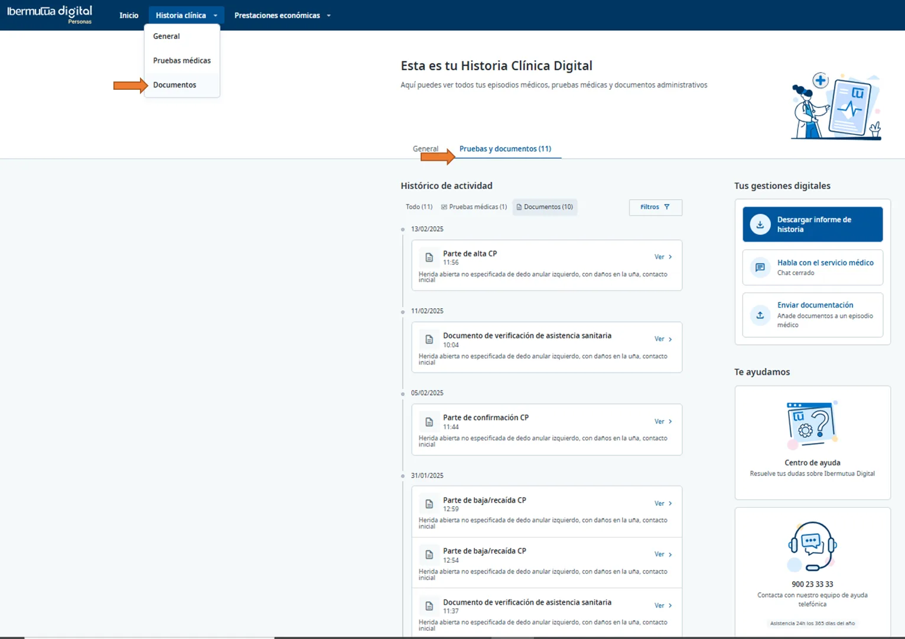
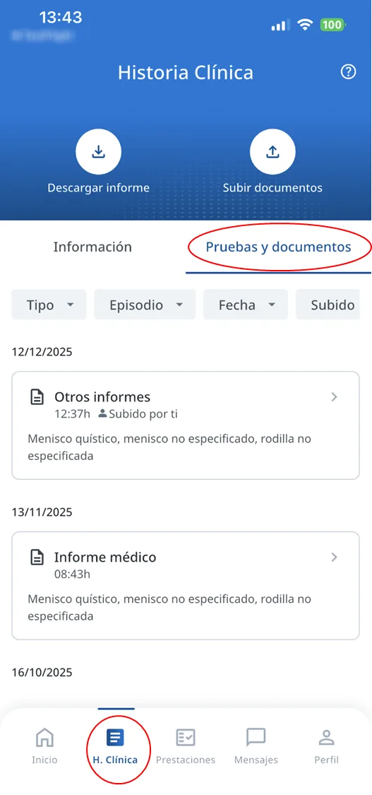
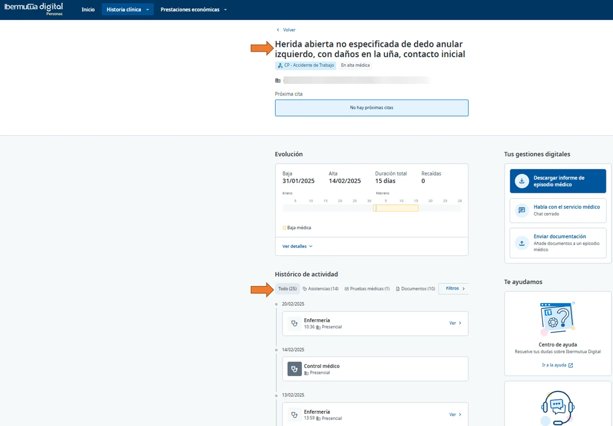
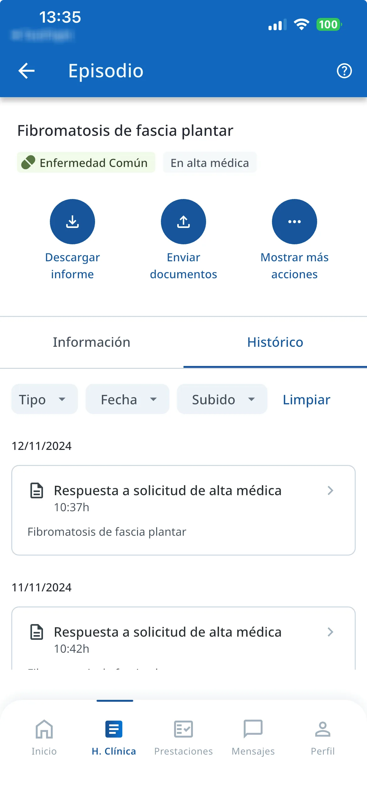
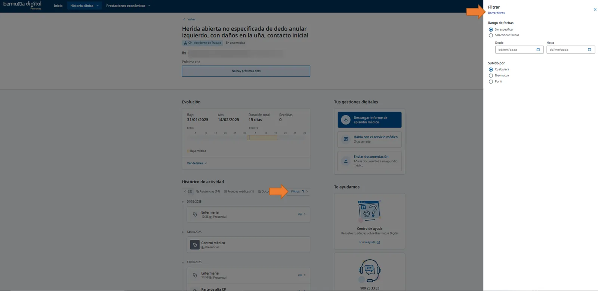
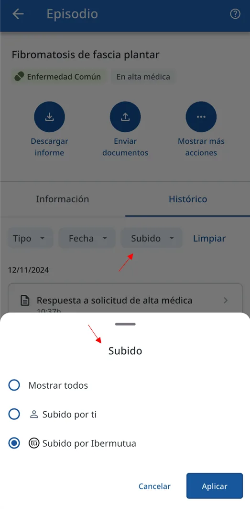

# Consultar la documentación administrativa

## 1. Consulta de toda la documentación de la Historia Clínica

Puedes visualizar la documentación administrativa generada a lo largo de toda la Historia Clínica con Ibermutua.

**¿Cómo consultar la documentación de tu historia clínica?**  



Se accede desde el menú superior **Historia Clínica \> Documentos**:

<figure> Documentos señalado con una flecha y pestaña Pruebas y documentos con el histórico de documentos."><figcaption>
Web: Historia Clínica > Documentos.
</figcaption></figure>


Se accede desde "**H. Clínica** " en la parte inferior, seleccionando "**Pruebas y documentos**" en la parte superior.

<figure><figcaption>
App: H. Clínica > Pruebas y documentos.
</figcaption></figure>



## 2. Consulta de documentación por Episodio

Otra forma de visualizar la documentación es [ir a un episodio concreto](consultar-tu-historia-clinica.md) y, desde ahí, acceder exclusivamente a la documentación asociada a dicho episodio.  




<figure><figcaption>
Web: documentación de un episodio concreto.
</figcaption></figure>



<figure><figcaption>
App: histórico de documentos del episodio.
</figcaption></figure>



## 3. Consulta de documentación por tipo de propietario

El [alta como paciente digital](https://soporte-ibermutua-digital.scroll.site/soporte-ibermutua-digital/tu-alta-y-acceso-a-ibermutua-digital-personas) implica la posibilidad de [poder enviar documentación](https://soporte-ibermutua-digital.scroll.site/soporte-ibermutua-digital/intercambio-online-de-documentacion-con-la-mutua) al servicio médico de la mutua, quedando automáticamente archivada en la historia clínica y accesible, por lo tanto, desde Ibermutua Digital. En todo momento, se podrá consultar de forma separada la información incorporada por el personal de la mutua de aquella documentación adjuntada por uno mismo.  



Podremos aplicar el **filtro** correspondiente para seleccionar la información que nos interesa.

<figure><figcaption>
Web: filtro por fecha y por quién ha subido el documento.
</figcaption></figure>


Se puede **filtrar** para obtener la información por fecha, de la documentación que has enviado o bien que ha sido remitida por la mutua.

<figure><figcaption>
App: filtro Subido.
</figcaption></figure>



## Preguntas frecuentes relacionadas

* [¿Qué documentación incluye la historia clínica?](../preguntas-frecuentes/que-incluye-la-historia-clinica.md)
