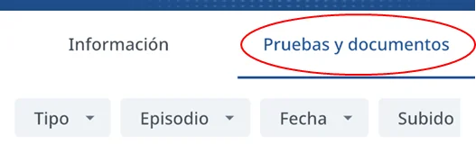
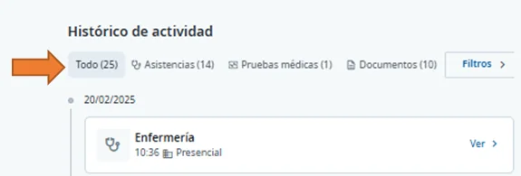
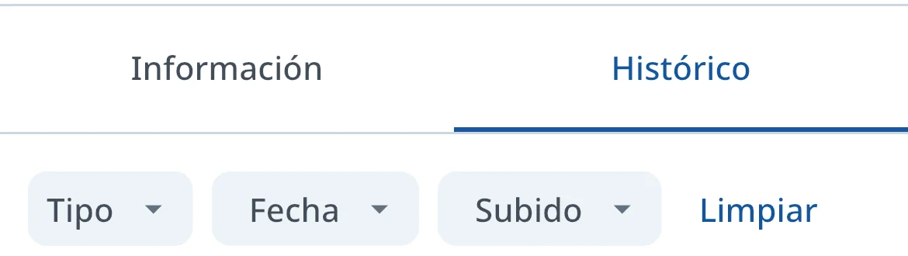
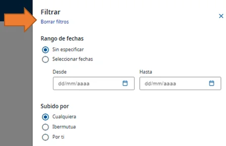
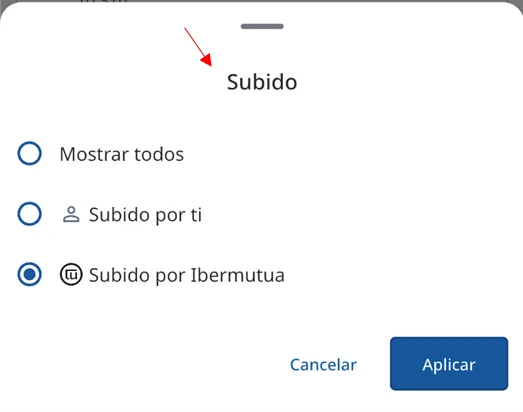

# Consultar la documentación administrativa

Puedes consultar toda la documentación de tu historia clínica o solo la de un episodio médico, y ver por separado la que ha incorporado Ibermutua y la que has enviado tú.

## Ver toda la documentación 



En el menú superior, pulsa **Historia clínica** y elige **Documentos**.

<figure></figure>



En el menú inferior, pulsa **H. Clínica** y, arriba, la pestaña **Pruebas y documentos**.

<figure></figure>



## Ver la documentación de un episodio 



[Abre el episodio médico en tu historia clínica](consultar-tu-historia-clinica.md#historia-abrir). En **Histórico de actividad** verás solo la documentación de ese episodio.

<figure></figure>



[Abre el episodio médico](consultar-tu-historia-clinica.md#historia-abrir) y entra en la pestaña **Histórico**. Puedes filtrar por tipo, fecha y quién lo ha subido.

<figure></figure>



## Filtrar por quién ha subido el documento 

Si [tienes el alta como paciente digital](../alta-y-acceso/darte-de-alta.md), puedes [enviar documentación al servicio médico](enviar-documentacion.md) de la mutua. Queda archivada en tu historia clínica, y siempre puedes ver por separado la que ha incorporado el personal de la mutua y la que has adjuntado tú.



Pulsa **Filtros** y elige un rango de fechas y, en **Subido por**, **Cualquiera**, **Ibermutua** o **Por ti**.

<figure></figure>



Usa el filtro **Subido** y elige **Mostrar todos**, **Subido por ti** o **Subido por Ibermutua**. También puedes filtrar por fecha.

<figure></figure>



## Más sobre la documentación 

**Preguntas frecuentes**



**También te puede interesar**


[Enviar documentación a la mutua](enviar-documentacion.md)

