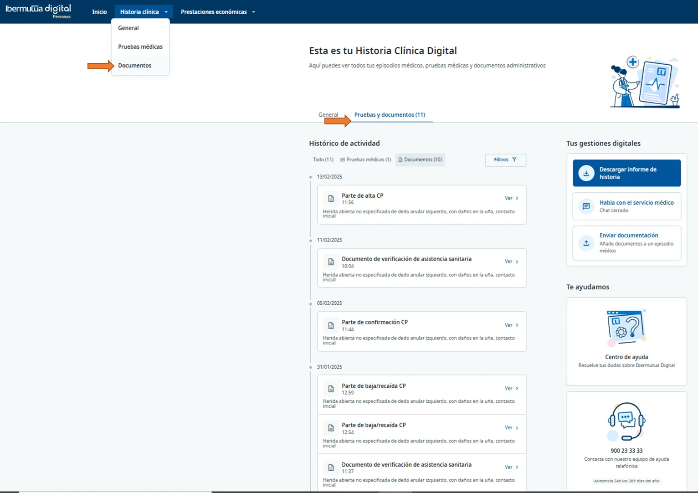
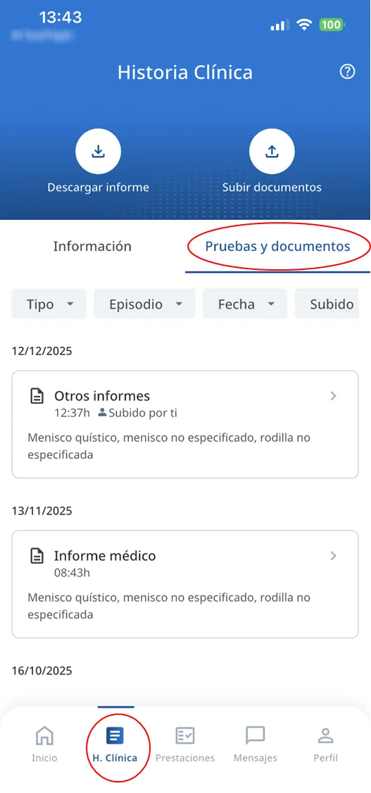
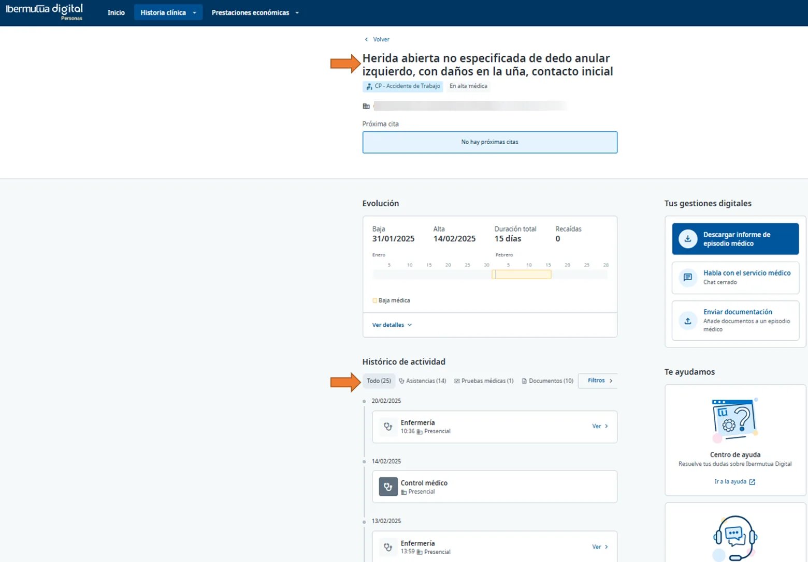
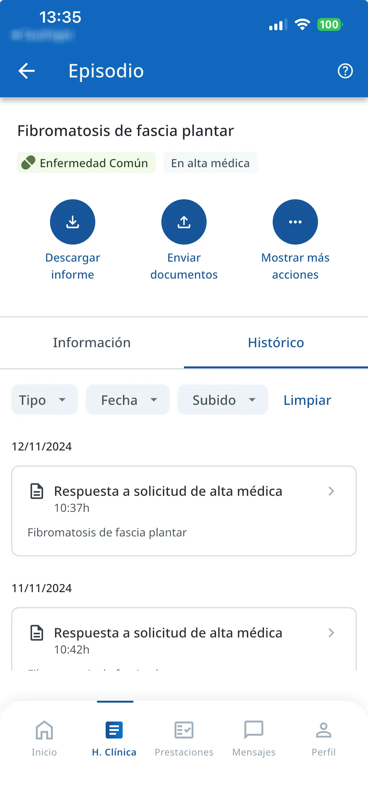
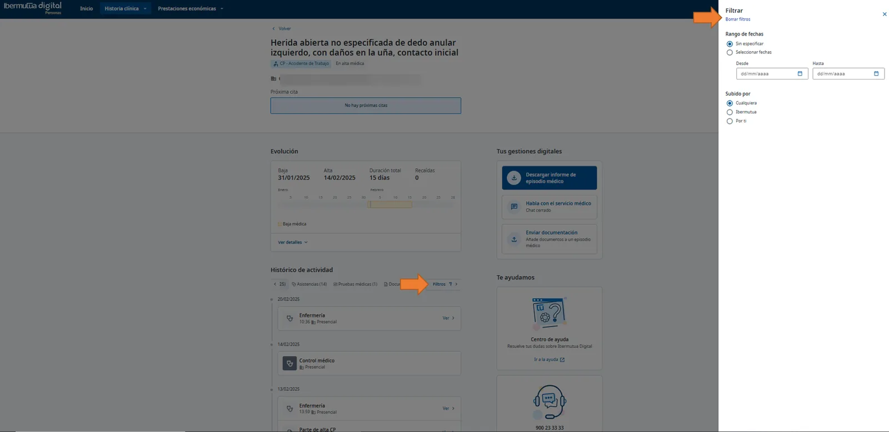
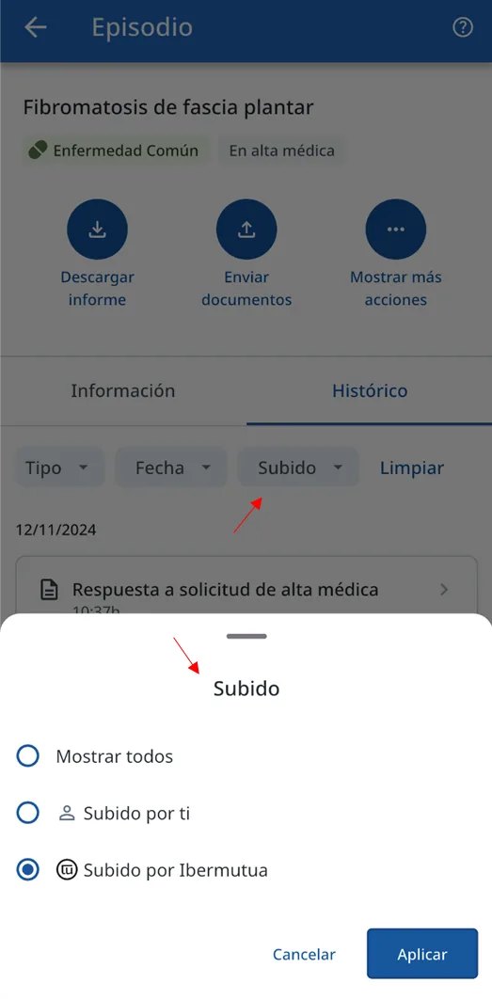

# Consultar la documentación administrativa

Puedes consultar toda la documentación de tu historia clínica, solo la de un episodio médico, o filtrarla para ver por separado la que ha subido Ibermutua y la que has enviado tú.

## Ver toda la documentación 



En el menú superior, pulsa **Historia clínica** y elige **Documentos**.

<figure> Documentos señalado con una flecha y pestaña Pruebas y documentos con el histórico de documentos."><figcaption>
Historia clínica > Documentos.
</figcaption></figure>



En el menú inferior, pulsa **H. Clínica** y, arriba, la pestaña **Pruebas y documentos**.

<figure><figcaption>
H. Clínica > Pruebas y documentos.
</figcaption></figure>



## Ver la documentación de un episodio 



Abre el episodio médico en tu historia clínica. En **Histórico de actividad** verás solo la documentación de ese episodio.

<figure><figcaption>
Documentación de un episodio.
</figcaption></figure>



Abre el episodio médico y entra en la pestaña **Histórico**. Puedes filtrar por tipo, fecha y quién lo ha subido.

<figure><figcaption>
Histórico de documentos del episodio.
</figcaption></figure>



## Filtrar por quién ha subido el documento 

Si tienes el alta como paciente digital, puedes enviar documentación al servicio médico de la mutua. Queda archivada en tu historia clínica, y siempre puedes ver por separado la que ha incorporado el personal de la mutua y la que has adjuntado tú.



Pulsa **Filtrar** y elige un rango de fechas y, en **Subido por**, **Cualquiera**, **Ibermutua** o **Por ti**.

<figure><figcaption>
Filtro por fecha y por quién ha subido el documento.
</figcaption></figure>



Usa el filtro **Subido** y elige **Mostrar todos**, **Subido por ti** o **Subido por Ibermutua**. También puedes filtrar por fecha.

<figure><figcaption>
Filtro Subido.
</figcaption></figure>



## Preguntas frecuentes 



## ¿Necesitas contactar? 


