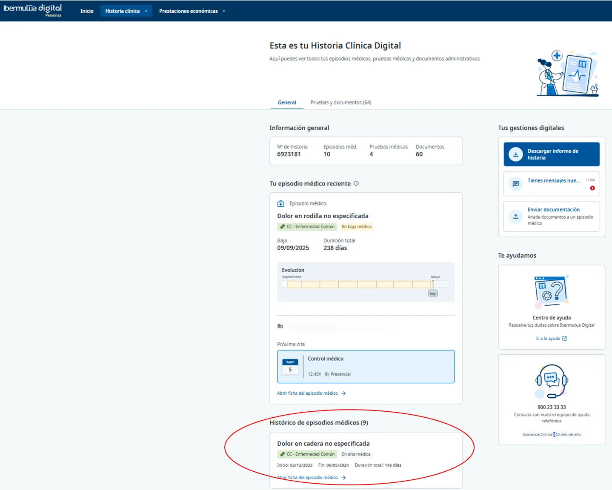
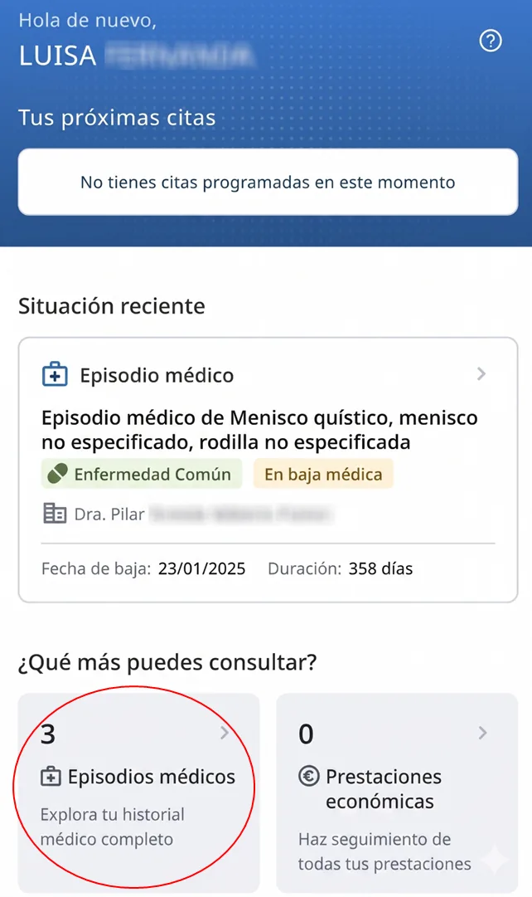

# Consultar episodios anteriores

Para consultar los episodios médicos ya realizados, accede a **Historia Clínica** . En la versión web, los encontrarás en la parte inferior, dentro del apartado **Histórico de episodios médicos** . Si accedes desde la aplicación móvil, podrás consultarlos en la sección **Episodios médicos**.  




<figure> General: bloque Histórico de episodios médicos resaltado en la parte inferior, con un episodio finalizado y su duración."><figcaption>
Web: Histórico de episodios médicos, en la parte inferior de la Historia Clínica.
</figcaption></figure>



<figure><figcaption>
App: acceso a Episodios médicos desde la pantalla de inicio.
</figcaption></figure>



## Preguntas frecuentes relacionadas

* [¿Puedo cambiar las citas desde Ibermutua Digital?](../preguntas-frecuentes/cambiar-una-cita.md)
