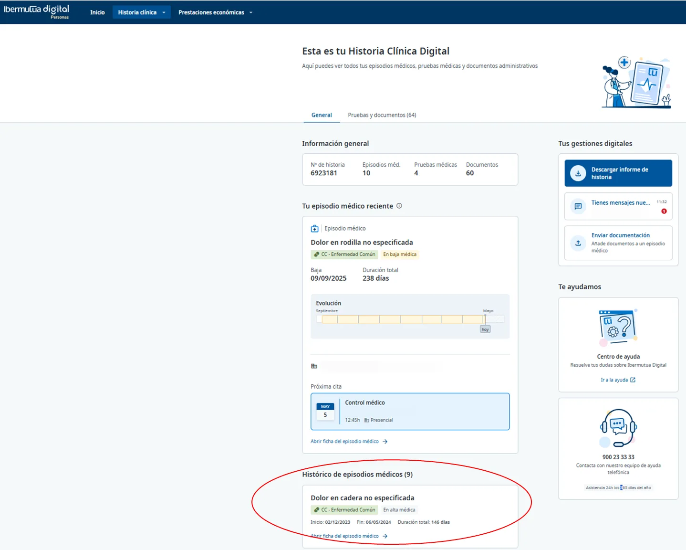
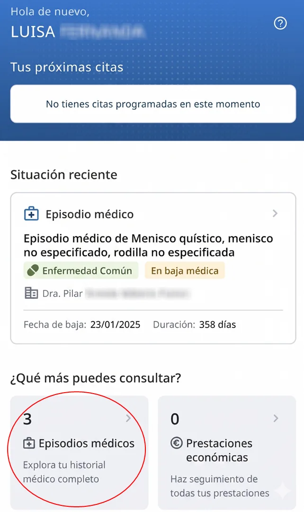

# Consultar episodios anteriores

Tus episodios médicos ya finalizados están en tu historia clínica. En la web aparecen al final de la página, en **Histórico de episodios médicos**. En la app, en **Episodios médicos**.





### Entra en Historia clínica 

En el menú superior, pulsa **Historia clínica**.



### Baja hasta el histórico 

Al final de la página, en **Histórico de episodios médicos**, tienes los episodios finalizados con su duración. Pulsa uno para ver su detalle.

<figure> General: bloque Histórico de episodios médicos resaltado en la parte inferior, con un episodio finalizado y su duración."><figcaption>
Histórico de episodios médicos.
</figcaption></figure>







### Abre Episodios médicos 

En la pantalla de inicio, en **¿Qué más puedes consultar?**, pulsa **Episodios médicos**.

<figure><figcaption>
Tarjeta Episodios médicos en la pantalla de inicio.
</figcaption></figure>





## Preguntas frecuentes 



## ¿Necesitas contactar? 


