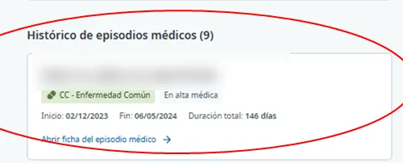
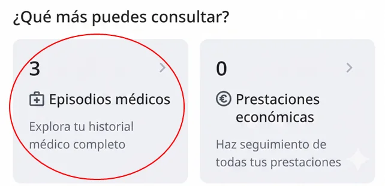

# Consultar episodios anteriores

Tus episodios médicos ya finalizados están en tu historia clínica. En la web aparecen al final de la página, en **Histórico de episodios médicos**; en la app, en **Episodios médicos**.

## Abre el histórico 





### Entra en Historia clínica

En el menú superior, pulsa **Historia clínica**.



### Baja hasta el histórico

Al final de la página, en **Histórico de episodios médicos**, tienes los episodios finalizados con su duración. Pulsa uno para ver su detalle.

<figure></figure>





En la pantalla de inicio, en **¿Qué más puedes consultar?**, pulsa **Episodios médicos**.

<figure></figure>



## Más sobre tu historia clínica 

**Preguntas frecuentes**



**También te puede interesar**


[Descargar un informe](descargar-un-informe.md)

