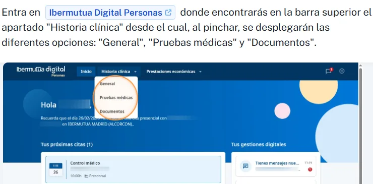
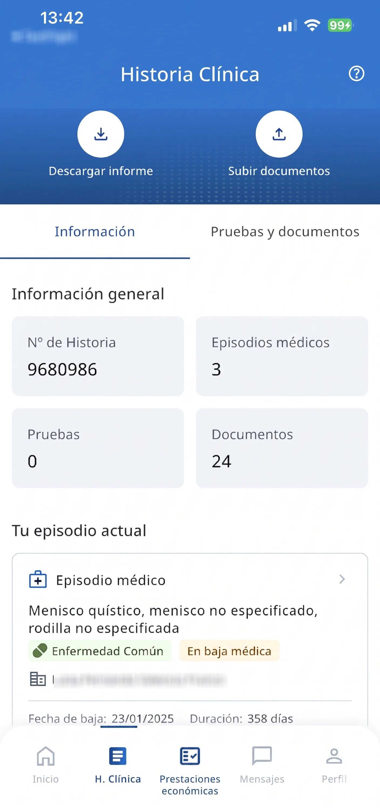

# Consultar tu historia clínica

Dispones de acceso a la información de tu [Historia Clínica](https://soporte-ibermutua-digital.scroll.site/soporte-ibermutua-digital/glosario) y toda tu Asistencia Médica dentro de [Ibermutua Digital Personas](https://personas.ibermutua.es/).


La [**Historia Clínica**](https://soporte-ibermutua-digital.scroll.site/soporte-ibermutua-digital/glosario) es el archivo de todos los procesos asistenciales producidos entre la mutua y el paciente. Se organiza por **Episodios Médicos** (cada cual con su diagnóstico, fecha de la baja y duración total).


## ¿Cómo puedes ver tu Historia Clínica?

1. **Acceso Web** : Accede desde el menú superior \> **Historia Clínica** donde podrás consultar tu/s proceso/s médico/s reciente/s así como un histórico de los mismos, si los hubiera.

2. **Acceso App**: Selecciona "Historia Clínica" en el menú inferior.




<figure><figcaption>
Web: menú superior Historia clínica con sus tres apartados.
</figcaption></figure>



<figure><figcaption>
App: pestaña H. Clínica en el menú inferior.
</figcaption></figure>



Accede a Historia Clínica para consultar:

* **Listado** : en cada uno de los episodios médicos, se muestra diagnóstico, estado y periodo de baja (inicio y duración total) con la información de la última asistencia en la parte superior y el [histórico de procesos médicos](consultar-episodios-anteriores.md) en la parte inferior.

* **Detalle**:

  * **Asistencias**: consultas, urgencias, rehabilitaciones y actuaciones clínicas realizadas.

  * [**Citas**](../citas-y-asistencias/consultar-tus-citas.md): próximas y pasadas del proceso médico correspondiente.

  * [**Pruebas**](ver-tus-pruebas-diagnosticas.md): radiografías, resonancias, analíticas y otros informes diagnósticos.

  * **Documentos**: informes clínicos, justificantes, altas/bajas médicas.

En "**Tus gestiones digitales**" situado en la parte derecha de la pantalla podrás:

1. Descargar [informe de historia](descargar-un-informe.md).

2. [Hablar con el servicio médico](https://soporte-ibermutua-digital.scroll.site/soporte-ibermutua-digital/chat-con-el-servicio-medico-de-ibermutua).

3. [Enviar documentación](https://soporte-ibermutua-digital.scroll.site/soporte-ibermutua-digital/intercambio-online-de-documentacion-con-la-mutua).


