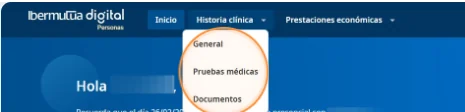
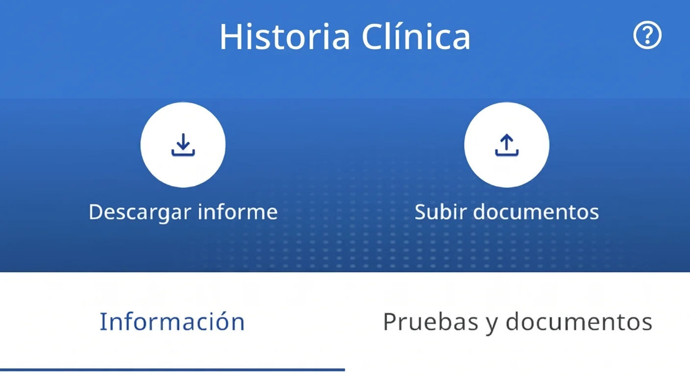

# Consultar tu historia clínica

Tu historia clínica reúne todos los procesos asistenciales entre la mutua y tú, organizados por **episodios médicos**: cada uno tiene su diagnóstico, la fecha de la baja y su duración total. Está en **Historia clínica**, en el menú superior de la web, y en **H. Clínica**, en el menú inferior de la app.

## Abre tu historia clínica 





### Entra en Historia clínica

En el menú superior, pulsa **Historia clínica** y elige **General**. Verás tus episodios médicos recientes y, si los hay, el histórico de los anteriores.

<figure></figure>



### Abre un episodio médico

Pulsa el episodio que quieres consultar para ver su detalle.







### Entra en H. Clínica

En el menú inferior, pulsa **H. Clínica**. Arriba tienes las pestañas **Información** y **Pruebas y documentos**.

<figure></figure>



### Abre un episodio médico

Pulsa el episodio que quieres consultar para ver su detalle.





## Qué encontrarás 

**Listado de episodios**

El diagnóstico, el estado y el periodo de baja (inicio y duración total) de cada episodio. Arriba aparece la información de la última asistencia y, abajo, [el histórico de episodios anteriores](consultar-episodios-anteriores.md).

**Detalle de cada episodio**

* **Asistencias:** consultas, urgencias, rehabilitaciones y actuaciones clínicas.
* **Citas:** [las próximas y las pasadas de ese episodio](../citas-y-asistencias/consultar-tus-citas.md).
* **Pruebas:** [radiografías, resonancias, analíticas y otros informes diagnósticos](ver-tus-pruebas-diagnosticas.md).
* **Documentos:** [informes clínicos, justificantes, altas y bajas médicas](consultar-documentacion-administrativa.md).

## Qué puedes hacer desde aquí 

En la web, en **Tus gestiones digitales**, a la derecha de la pantalla, puedes:

**A. Descargar el informe de tu historia clínica**

Consulta [cómo descargar el informe](descargar-un-informe.md).

**B. Hablar con el servicio médico por chat**

Para dudas médicas sobre tu episodio. Consulta [cómo usar el chat](https://soporte-ibermutua-digital.scroll.site/soporte-ibermutua-digital/chat-con-el-servicio-medico-de-ibermutua).

**C. Enviar documentación a la mutua**

Consulta [cómo enviar documentación](enviar-documentacion.md).



## Más sobre tu historia clínica 

**Preguntas frecuentes**



**También te puede interesar**


[Consultar episodios anteriores](consultar-episodios-anteriores.md)



[Descargar un informe](descargar-un-informe.md)

