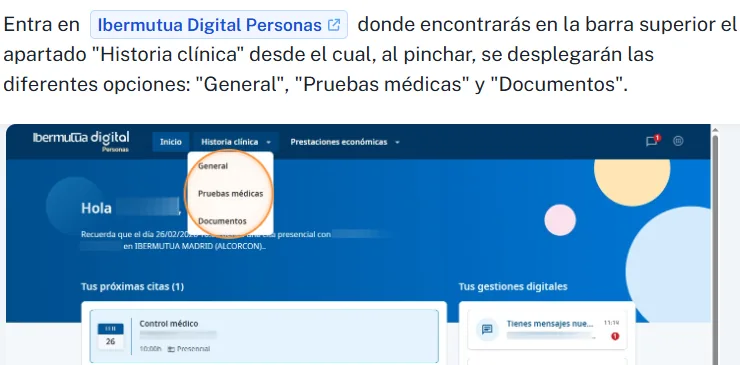
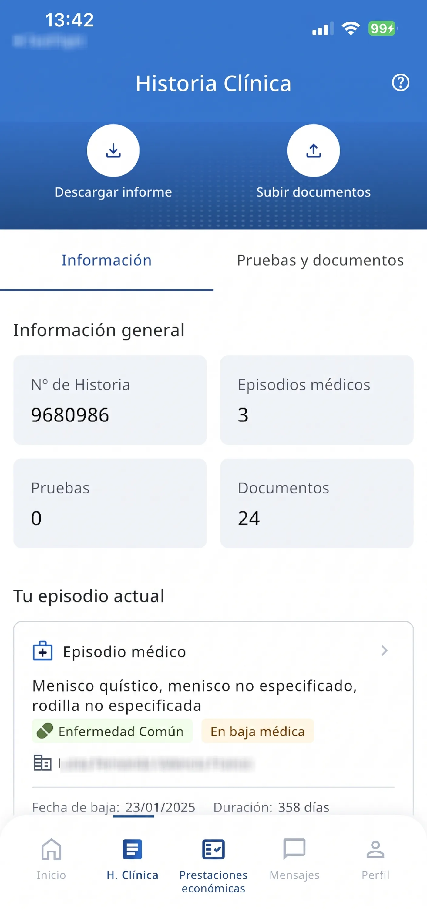

# Consultar tu historia clínica

Tu historia clínica está en **Historia clínica**, en el menú superior de la web o en **H. Clínica**, en el menú inferior de la app. Ahí ves tus episodios médicos recientes y anteriores, con sus asistencias, citas, pruebas y documentos.


La historia clínica reúne todos los procesos asistenciales entre la mutua y tú. Se organiza por **episodios médicos**: cada uno tiene su diagnóstico, la fecha de la baja y su duración total.






### Entra en Historia clínica 

En el menú superior, pulsa **Historia clínica**. Verás tus episodios médicos recientes y, si los hay, el histórico de los anteriores.

<figure><figcaption>
Menú Historia clínica con sus apartados.
</figcaption></figure>



### Abre un episodio médico 

Pulsa el episodio que quieres consultar para ver su detalle.







### Entra en H. Clínica 

En el menú inferior, pulsa **H. Clínica**.

<figure><figcaption>
Pantalla H. Clínica en la app.
</figcaption></figure>



### Abre un episodio médico 

Pulsa el episodio que quieres consultar para ver su detalle.





## Qué encontrarás 

* **Listado de episodios:** diagnóstico, estado y periodo de baja (inicio y duración total) de cada episodio. Arriba aparece la información de la última asistencia y, abajo, [el histórico de episodios anteriores](consultar-episodios-anteriores.md).
* **Detalle de cada episodio:**
  * **Asistencias:** consultas, urgencias, rehabilitaciones y actuaciones clínicas.
  * **Citas:** [las próximas y las pasadas de ese episodio](../citas-y-asistencias/consultar-tus-citas.md).
  * **Pruebas:** [radiografías, resonancias, analíticas y otros informes diagnósticos](ver-tus-pruebas-diagnosticas.md).
  * **Documentos:** [informes clínicos, justificantes, altas y bajas médicas](consultar-documentacion-administrativa.md).

## Qué puedes hacer desde aquí 

En la web, en **Tus gestiones digitales**, a la derecha de la pantalla, puedes:

* [descargar el informe de tu historia clínica](descargar-un-informe.md);
* [hablar con el servicio médico por chat](https://soporte-ibermutua-digital.scroll.site/soporte-ibermutua-digital/chat-con-el-servicio-medico-de-ibermutua);
* [enviar documentación a la mutua](https://soporte-ibermutua-digital.scroll.site/soporte-ibermutua-digital/intercambio-online-de-documentacion-con-la-mutua).



## Preguntas frecuentes 



## ¿Necesitas contactar? 


