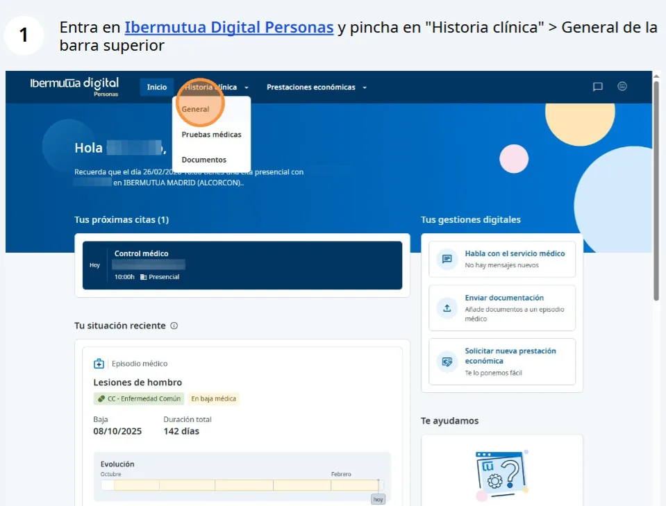
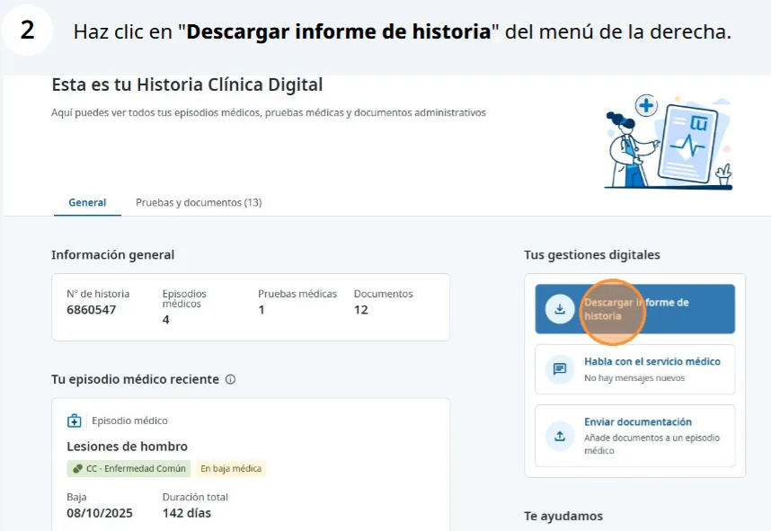
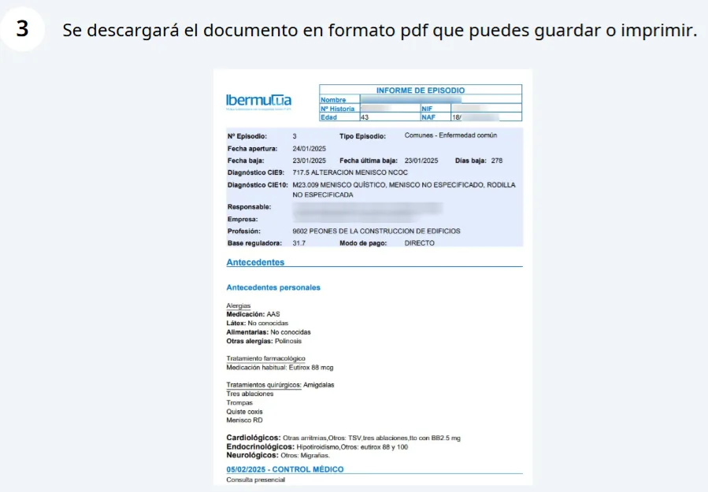

# Descargar un informe

¿Necesitas ver tu informe clínico? Dirígete al menú superior y entra en **Historia Clínica \> General** . Tras seleccionar el episodio médico de tu interés (como por ejemplo el más reciente) podrás consultar el detalle del mismo. Además, desde el menú lateral derecho, podrás elegir **"Descargar informe de historia"** para obtener en PDF el documento correspondiente que incluirá tus **antecedentes personales y la información clínica** correspondiente.  



### Accede a Historia Clínica \> General

<figure><figcaption>
1. Entra en Historia clínica > General en la barra superior.
</figcaption></figure>


### Selecciona el episodio médico y podrás obtener el informe

<figure><figcaption>
2. Haz clic en «Descargar informe de historia» en el menú de la derecha.
</figcaption></figure>


### Descarga del informe del episodio médico

<figure><figcaption>
3. El informe se descarga en PDF para guardarlo o imprimirlo.
</figcaption></figure>



## Preguntas frecuentes relacionadas

* [Ver tus pruebas diagnósticas](ver-tus-pruebas-diagnosticas.md)
* [¿Qué es la segunda opinión médica?](../preguntas-frecuentes/que-es-la-segunda-opinion.md)
* [¿Qué diferencia hay entre el informe de historia clínica y el de episodio médico?](../preguntas-frecuentes/informe-historia-clinica-o-episodio.md)
