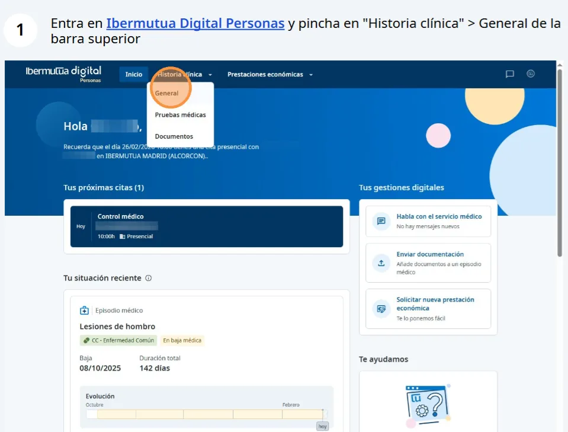
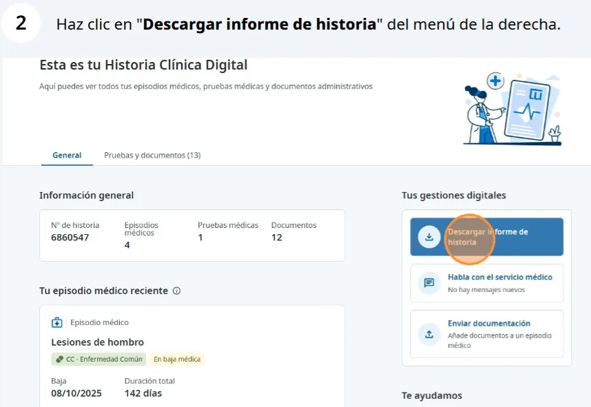
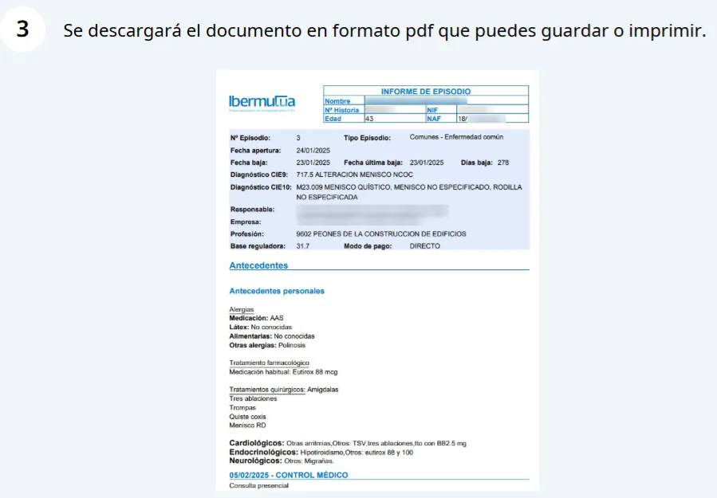

# Descargar un informe

Puedes descargar en PDF el informe de tu historia clínica, con tus antecedentes personales y la información clínica. Se hace desde **Historia clínica > General**, en **Tus gestiones digitales**.



### Entra en Historia clínica > General 

En el menú superior, pulsa **Historia clínica** y elige **General**.

<figure><figcaption>
Historia clínica > General.
</figcaption></figure>



### Elige el episodio y descarga el informe 

Pulsa el episodio médico que te interesa, por ejemplo el más reciente, para ver su detalle. Después, en **Tus gestiones digitales**, a la derecha, pulsa **Descargar informe de historia**.

<figure><figcaption>
Descargar informe de historia, en Tus gestiones digitales.
</figcaption></figure>



### Guarda el PDF 

El informe se descarga en PDF. Puedes guardarlo o imprimirlo.

<figure><figcaption>
Ejemplo de informe en PDF.
</figcaption></figure>




**Al terminar** tendrás el informe en PDF en tu dispositivo.


## Preguntas frecuentes 



## Siguientes pasos 


[ver-tus-pruebas-diagnosticas.md](ver-tus-pruebas-diagnosticas.md)



[solicitar-una-segunda-opinion.md](solicitar-una-segunda-opinion.md)


## ¿Necesitas contactar? 


