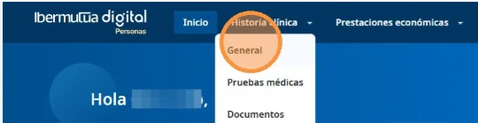
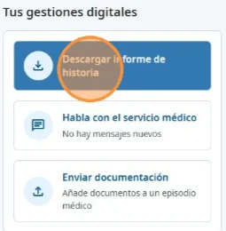

# Descargar un informe

Puedes descargar en PDF el informe de tu historia clínica, con tus antecedentes personales y la información clínica. Se hace desde **Historia clínica > General**, en **Tus gestiones digitales**.

## Descarga el informe 



### Entra en Historia clínica > General

En el menú superior, pulsa **Historia clínica** y elige **General**.

<figure></figure>



### Elige el episodio y descarga el informe

Pulsa el episodio médico que te interesa, por ejemplo el más reciente, para ver su detalle. Después, en **Tus gestiones digitales**, a la derecha, pulsa **Descargar informe de historia**.

<figure></figure>



### Guarda el PDF

El informe se descarga en PDF. Puedes guardarlo o imprimirlo.



## Más sobre informes 

**Preguntas frecuentes**



**También te puede interesar**


[Ver tus pruebas diagnósticas](ver-tus-pruebas-diagnosticas.md)



[Consultar episodios anteriores](consultar-episodios-anteriores.md)

