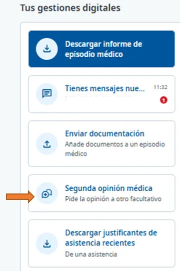
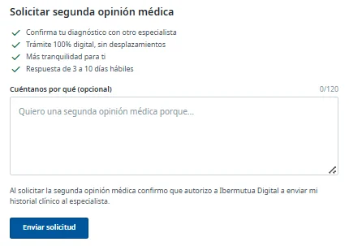
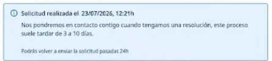
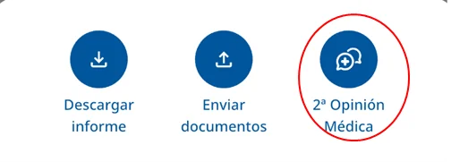
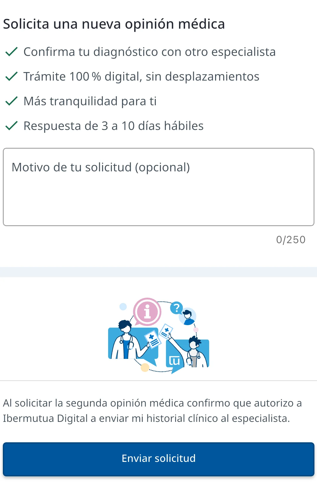

# Solicitar una segunda opinión médica

Puedes [solicitar una segunda opinión médica](../preguntas-frecuentes/que-es-la-segunda-opinion.md) online, desde un episodio de tu historia clínica, o en persona en cualquier [centro de Ibermutua](https://www.ibermutua.es/red-de-centros/). Online, la solicitud se hace en dos pasos y [te contactarán en un plazo de 3 a 10 días](../preguntas-frecuentes/que-es-la-segunda-opinion.md#segunda-opinion-plazos).

## Solicita la segunda opinión 





### Abre la solicitud desde el episodio

En **Historia clínica > General**, [abre el episodio](consultar-tu-historia-clinica.md#historia-abrir). En **Tus gestiones digitales**, a la derecha, pulsa **Segunda opinión médica**.

<figure></figure>



### Envía la solicitud

El episodio ya aparece seleccionado. Si quieres, cuéntanos por qué pides la segunda opinión. Pulsa **Enviar solicitud**.

<figure></figure>

Verás la confirmación de la solicitud, con el plazo en el que te contactarán.

<figure></figure>







### Abre la solicitud desde el episodio

En **H. Clínica**, pulsa el episodio médico. Después, pulsa **Mostrar más acciones** y elige **2ª Opinión Médica**.

<figure></figure>



### Envía la solicitud

Selecciona el episodio. Si quieres, explica el motivo de tu solicitud. Pulsa **Enviar solicitud**.

<figure></figure>

Verás la confirmación de la solicitud, con el plazo en el que te contactarán.

<figure></figure>





## Más sobre la segunda opinión 

**Preguntas frecuentes**


