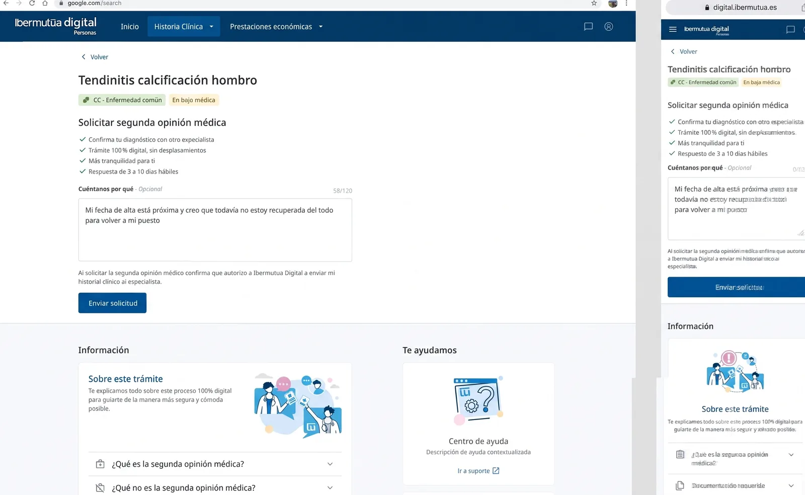
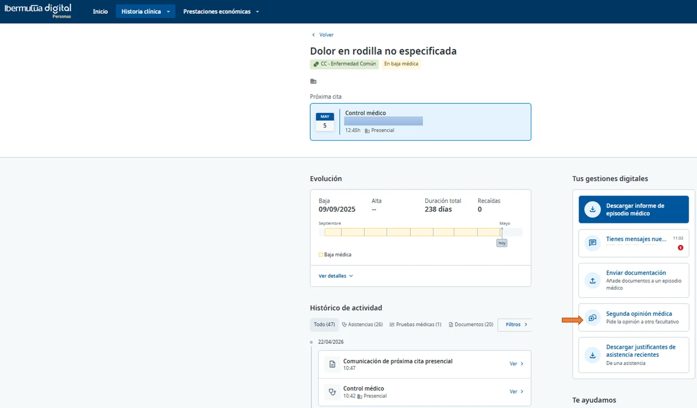
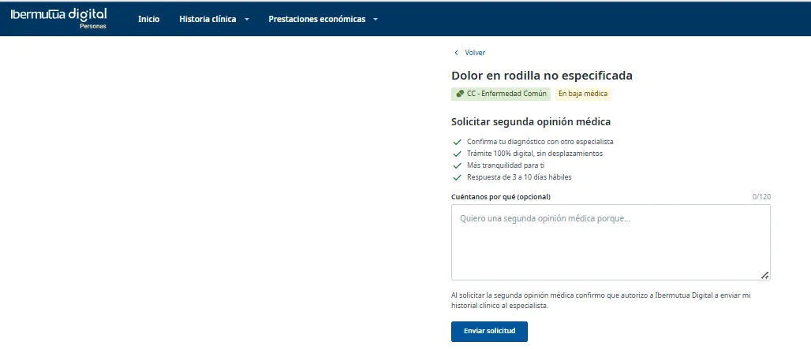
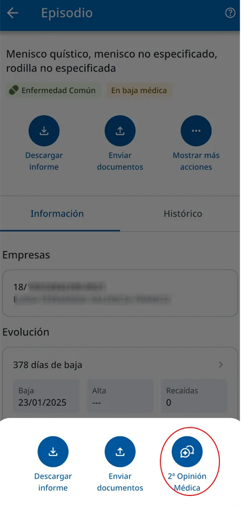
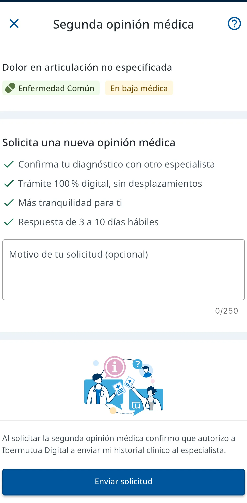
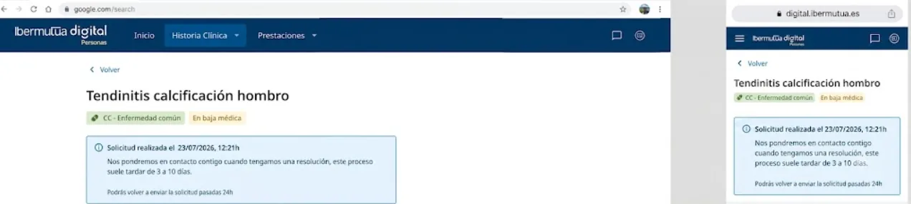

# Solicitar una segunda opinión médica

Puedes solicitar una segunda opinión médica online, desde un episodio de tu historia clínica, o en persona en cualquier [centro de Ibermutua](https://www.ibermutua.es/red-de-centros/). Online, la solicitud se hace en dos pasos y te contactarán en un plazo de 3 a 10 días.

<figure><figcaption>
Solicitud de segunda opinión médica en web y en el móvil.
</figcaption></figure>





### Abre la solicitud desde el episodio 

En **Historia clínica > General**, abre el episodio. A la derecha, pulsa **Segunda opinión médica**.

<figure><figcaption>
Segunda opinión médica, a la derecha del episodio.
</figcaption></figure>



### Envía la solicitud 

El episodio ya aparece seleccionado. Si quieres, cuéntanos por qué pides la segunda opinión. Pulsa **Enviar solicitud**.

<figure><figcaption>
Formulario de solicitud.
</figcaption></figure>







### Abre la solicitud desde el episodio 

En **H. Clínica**, pulsa el episodio médico. Después, pulsa **Mostrar más acciones** y elige **2ª Opinión Médica**.

<figure><figcaption>
Mostrar más acciones > 2ª Opinión Médica.
</figcaption></figure>



### Envía la solicitud 

Selecciona el episodio. Si quieres, explica el motivo de tu solicitud. Pulsa **Enviar solicitud**.

<figure><figcaption>
Formulario de solicitud en la app.
</figcaption></figure>






**Al terminar** verás la confirmación de la solicitud. Te contactarán en un plazo de 3 a 10 días.


<figure><figcaption>
Confirmación de la solicitud.
</figcaption></figure>

## Preguntas frecuentes 



## ¿Necesitas contactar? 


