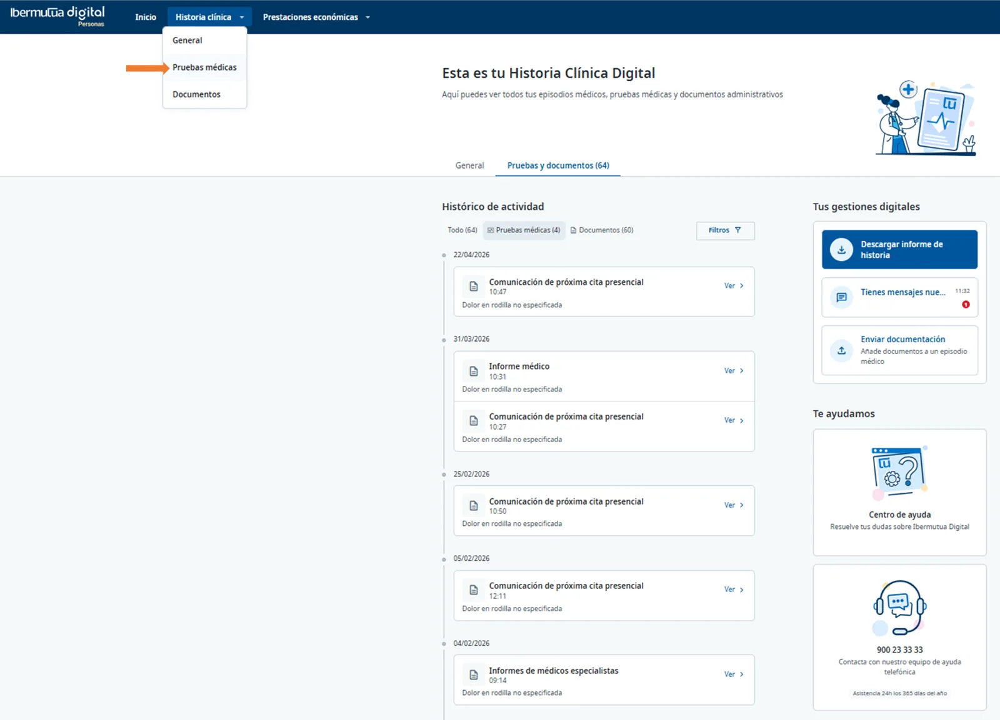
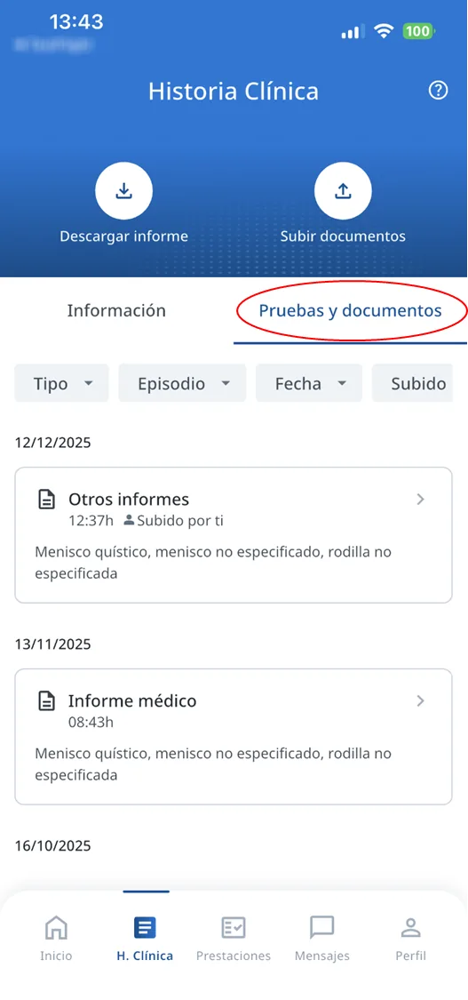
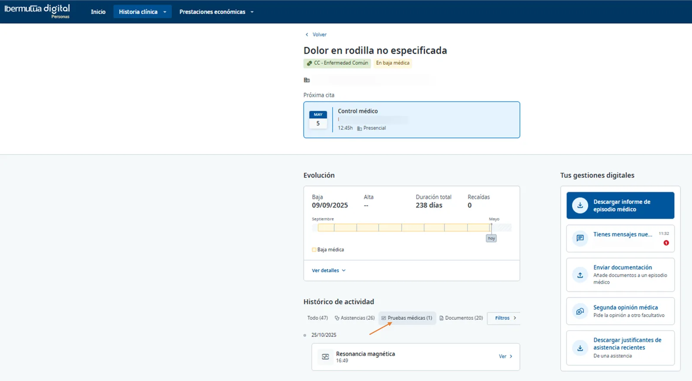
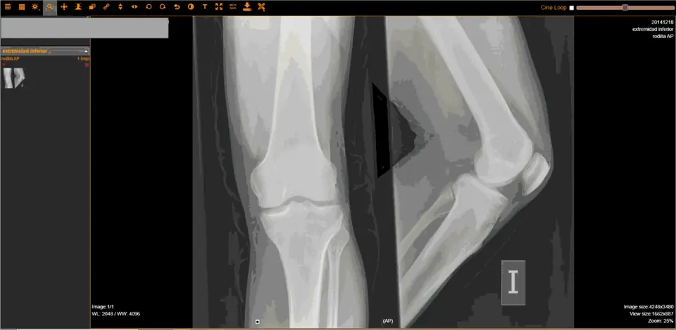

# Ver tus pruebas diagnósticas

Puedes ver todas las pruebas diagnósticas que te ha hecho Ibermutua, o solo las de un episodio médico. Las pruebas de imagen se abren en un visor especial.

## Ver todas tus pruebas 



En el menú superior, pulsa **Historia clínica** y elige **Pruebas médicas**. Se abre la pestaña **Pruebas y documentos** con todas tus pruebas.

<figure> Pruebas médicas señalado con una flecha; pestaña Pruebas y documentos con el histórico de actividad."><figcaption>
Historia clínica > Pruebas médicas.
</figcaption></figure>



En **H. Clínica**, pulsa la pestaña **Pruebas y documentos**. Puedes filtrar por tipo, episodio, fecha y quién lo ha subido.

<figure><figcaption>
Pestaña Pruebas y documentos.
</figcaption></figure>



## Ver las pruebas de un episodio 



[Abre el episodio médico en tu historia clínica](consultar-tu-historia-clinica.md#historia-episodio). En **Histórico de actividad**, filtra por **Pruebas médicas**.

<figure><figcaption>
Filtro Pruebas médicas en el episodio.
</figcaption></figure>



En **H. Clínica**, [abre el episodio médico](consultar-tu-historia-clinica.md#historia-episodio-app) y consulta sus pruebas en **Pruebas y documentos**.



## Ver una prueba de imagen 

Las pruebas de imagen (radiografía, resonancia magnética, TAC…) se abren en un visor especial que permite verlas con detalle.

<figure><figcaption>
Visor de pruebas de imagen.
</figcaption></figure>

## Preguntas frecuentes 



## Siguientes pasos 


[descargar-un-informe.md](descargar-un-informe.md)



[solicitar-una-segunda-opinion.md](solicitar-una-segunda-opinion.md)


## ¿Necesitas contactar? 


