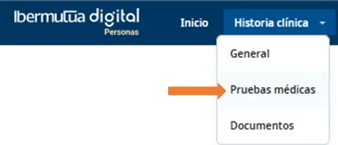
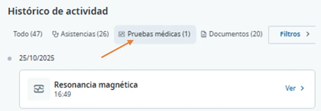

# Ver tus pruebas diagnósticas

Puedes ver todas las pruebas diagnósticas que te ha hecho Ibermutua o solo las de un episodio médico. Las pruebas de imagen se abren en un visor especial. Si no ves una prueba reciente, consulta [cuándo están disponibles](../preguntas-frecuentes/cuando-estan-disponibles-las-pruebas.md).

## Ver todas tus pruebas 



En el menú superior, pulsa **Historia clínica** y elige **Pruebas médicas**. Se abre la pestaña **Pruebas y documentos** con todas tus pruebas.

<figure></figure>



En **H. Clínica**, pulsa la pestaña **Pruebas y documentos**. Puedes filtrar por tipo, episodio, fecha y quién lo ha subido.

<figure></figure>



## Ver las pruebas de un episodio 



[Abre el episodio médico en tu historia clínica](consultar-tu-historia-clinica.md#historia-abrir). En **Histórico de actividad**, pulsa el filtro **Pruebas médicas**.

<figure></figure>



En **H. Clínica**, [abre el episodio médico](consultar-tu-historia-clinica.md#historia-abrir) y consulta sus pruebas en **Pruebas y documentos**.



## Ver una prueba de imagen 

Las pruebas de imagen (radiografía, resonancia magnética, TAC…) se abren en un visor especial que permite verlas con detalle.

<figure></figure>

## Más sobre pruebas diagnósticas 

**Preguntas frecuentes**



**También te puede interesar**


[Descargar un informe](descargar-un-informe.md)

